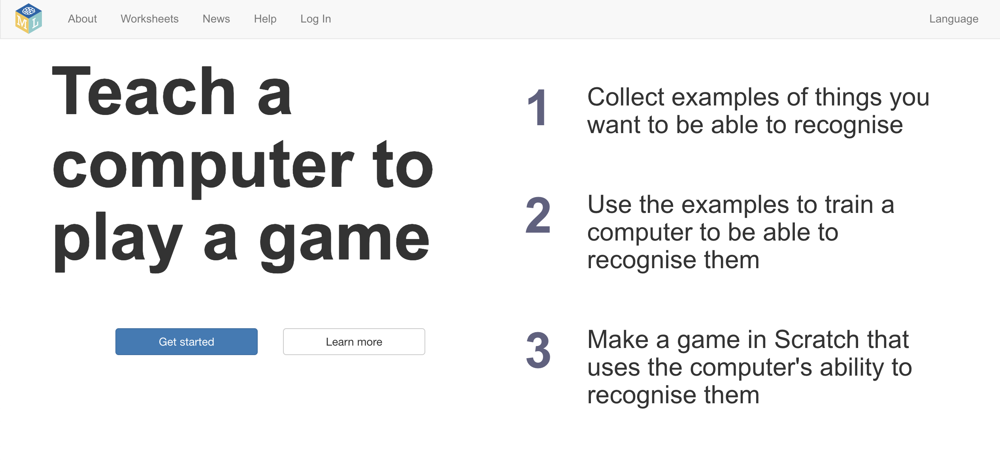
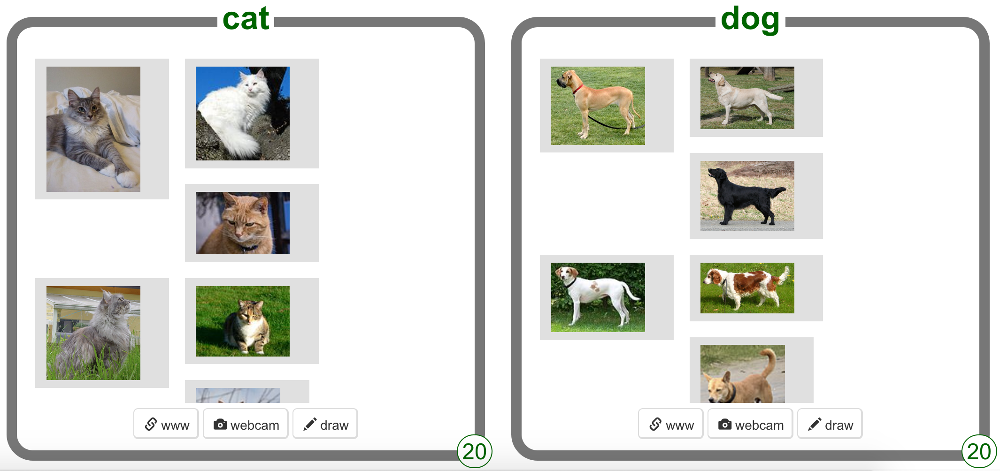
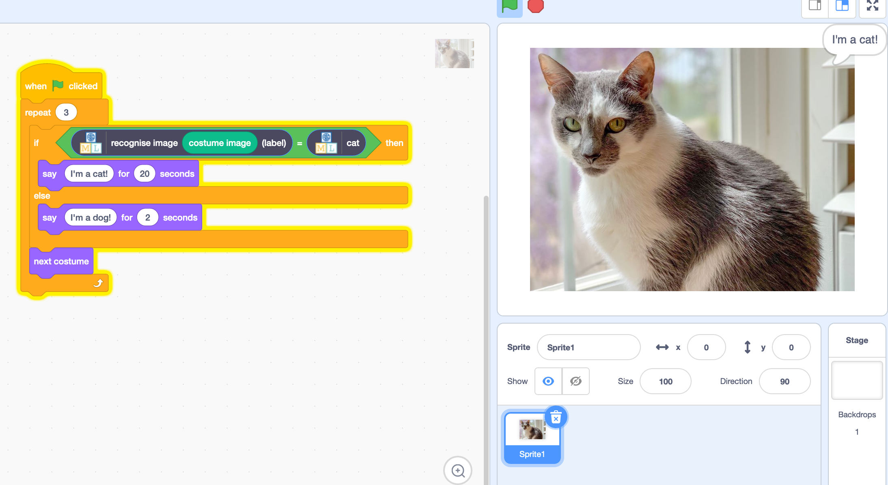
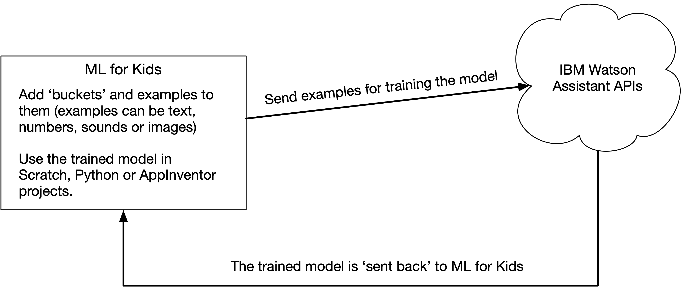

footer: [CS4S 2019 - AI Workshop](https://cs4s.github.com/2019/ai)

# Coding & STEM 4 Schools

## 2019 AI Workshop

### Training a Smart Assistant

#### Presented by Mr Daniel Hickmott on 12th November 2019

---

# Machine Learning for Kids

- Free to use, although there can be some cost involved
- Non-commercial and all web-based
- Created and maintained by [Dale Lane](https://dalelane.co.uk/) (Developer at IBM)
- Can use with Scratch, Python and AppInventor
- Important: the Scratch used within ML for Kids is not the 'real' Scratch

---

[https://machinelearningforkids.co.uk](https://machinelearningforkids.co.uk)

---

# Using Machine Learning for Kids

- Usually involves two main steps:
	- We train a model by giving the computer examples split into different 'buckets', e.g. spam or not spam (*supervised learning*)
	- Code (e.g. Scratch blocks) are created that use the model to classify new data into these buckets

---

# Training with Examples

---

# Coding with the Model

---

# How it Works

- Usage of IBM Watson Assistant can cost $

---

# Resources

- [Worksheets](https://machinelearningforkids.co.uk/#!/worksheets)
- Project templates (e.g, pictures of cats and dogs, passengers on the titanic)
- Sample projects within Scratch and Code editors
- [Raspberry Pi Foundation: Scratch Machine Learning projects](https://projects.raspberrypi.org/en/pathways/scratch-machine-learning)

---

# Training a Smart Assistant

- We will use the Raspberry Pi Foundation's version of the [Smart Classroom Assistant](https://projects.raspberrypi.org/en/projects/smart-classroom) activity 
- We will compare coding with rules and machine learning first
- You will create a Scratch project that 'understands' different instructions for turning a fan and light on and off

---

# Application of these Models

- [Amazon Alexa Skills](https://www.amazon.com/alexa-skills/b/ref=skillsrw_surl?ie=UTF8&node=13727921011)
- As described in [Smart Classroom activity](https://projects.raspberrypi.org/en/projects/smart-classroom/8):
	- Buckets are created for different commands
	- Examples of appropriate phrases are added to each of the buckets
	- Model is trained with these examples

