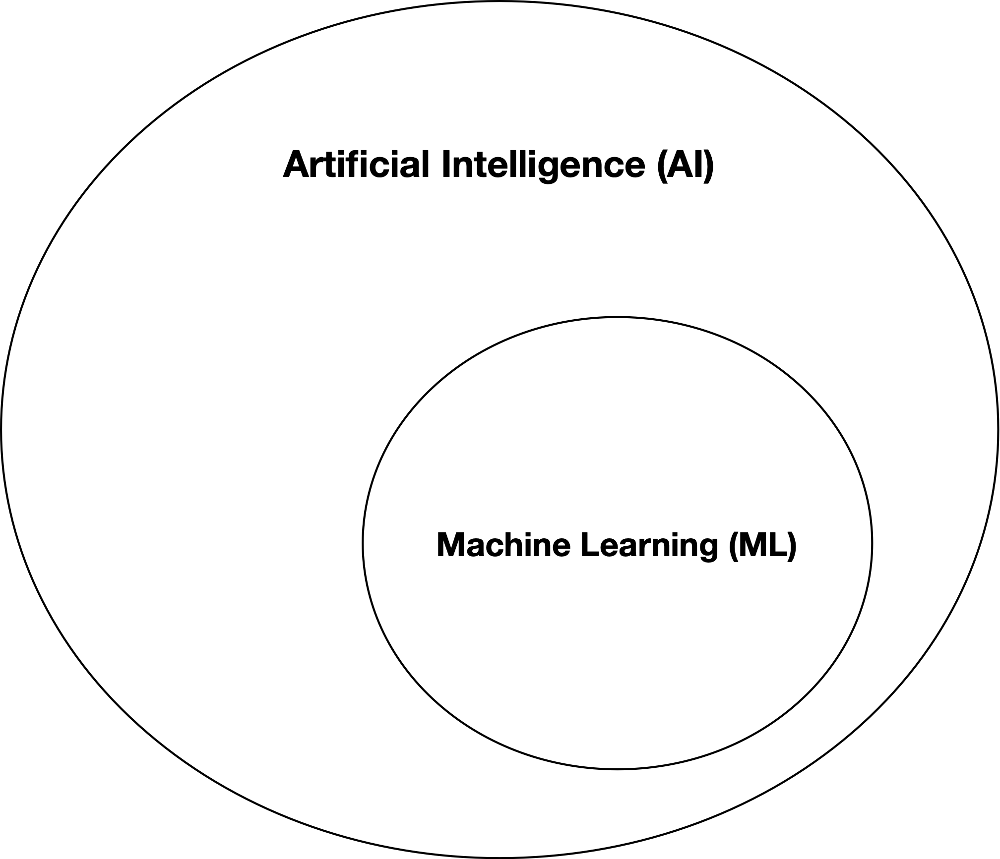
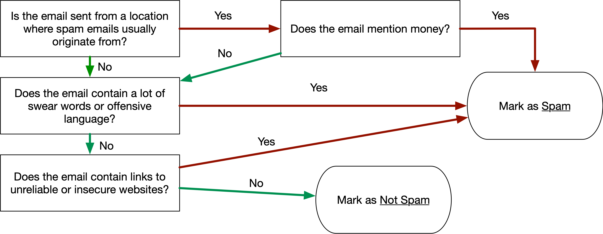
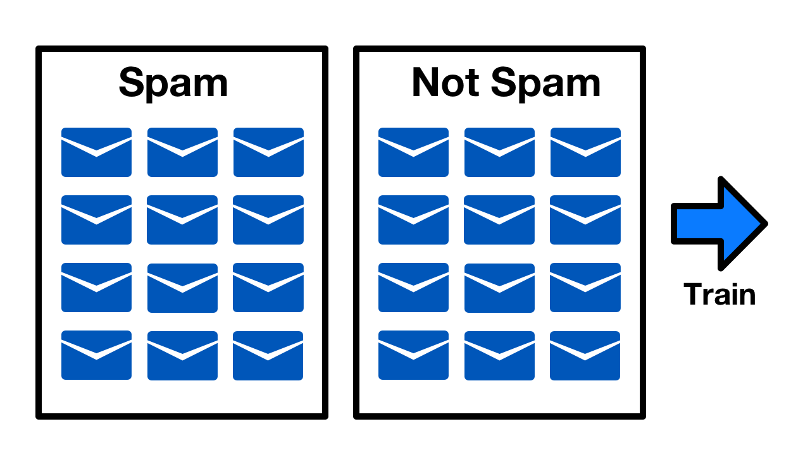

footer: [CS4S 2019 - AI Workshop](https://cs4s.github.com/2019/ai)

# Coding & STEM 4 Schools

## 2019 AI Workshop

### Artificial Intelligence & Machine Learning

#### Presented by Mr Daniel Hickmott on 12th November 2019

---

# Artificial Intelligence (AI)

- Artificial Intelligence (AI) is part of our daily lives
- What are some examples of AI that you use or are impacted by?

---

# Defining AI

- The ability for a computer to perform human-like thought processes, ["...such as the ability to reason, discover meaning, generalize, or learn from past experience"](https://www.britannica.com/technology/artificial-intelligence)
- AI is a very large topic - includes philosophy, ethics, AI algorithms...
- Different approaches (e.g. simulating how a human brain works vs more 'traditional' statistical techniques)

---

# Four Types of AI

- [Four types of AI](https://theconversation.com/understanding-the-four-types-of-ai-from-reactive-robots-to-self-aware-beings-67616), categorised as *Narrow AI* or *General AI*:
	- *Narrow AI:* Reactive Machines, Limited Memory
	- *General AI:* Theory of Mind, Self-Awareness
- *General AI* does not exist yet! (except in movies)
- Most AI that we encounter is *Narrow AI* (solves specific problems, e.g. a chess playing AI)

---

# Why Teach AI?

- Similar reasons for teaching coding to everyone:
	- Jobs (impact of automation)
	- AI Literacy	 
	- Understanding their world
	- Broadening participation
- In curriculum?

---

# AI in Curriculum: Primary

- Not specifically in K-6 syllabuses
- *ICT Capability* (e.g. creating with ICT)
- *Ethical Understanding* (e.g. understanding ethical concepts and issues that relate to AI)
- *Digital Technologies* in *Science and Technology K-6* (e.g. ST3-2DP-T: plans and uses materials, tools and equipment to develop solutions for a need or opportunity) 

---

# AI in Curriculum: Secondary

- *Digital Technologies* in *Technology Mandatory 7-8* (e.g. TE4-1DP designs, communicates and evaluates innovative ideas and creative solutions to authentic problems or opportunities)
- Draft syllabus for *Integrated Computing 7-10* includes AI content, e.g.'explore how artificial intelligence is used to predict patterns of behaviour'
- Draft syllabus for *Software Engineering* includes AI content, e.g. 'develop algorithms that describe artificial neural networks'

---

# Resources for Teaching AI

- Likely that AI will have to be taught to some students in the near future
- There's arguments for teaching AI to every student
- How can we give students an accessible and practical introduction to creating AI?
- Our view was that there was not much out there about AI projects for students
- Luckily, [Machine Learning for Kids](https://machinelearningforkids.co.uk/) exists!

---

# Other AI Topics

- Coded chatbots
	- [ELIZA](https://www.masswerk.at/elizabot/)
	- [Code Club's Scratch Chatbot project](https://codeclubprojects.org/en-GB/scratch/chatbot/)
	- [Grok Learning's Python Chatbot](https://groklearning.com/course/aca-dt-78-py-chatbot/)
- Philosophy and History of AI
	- [Turing Test](https://www.turing.org.uk/scrapbook/test.html)
	- [AI Winter](https://en.wikipedia.org/wiki/AI_winter)

---

# Other AI Topics
	 
- Future of work and impact of automation:
	- [The New Work Mindset](https://www.fya.org.au/wp-content/uploads/2016/11/The-New-Work-Mindset.pdf) (Free report)
	- [Future of the Professions](https://www.danielsusskind.com/book) (Book)
	- [Rise of the Robots](https://mfordfuture.com/writing/) (Book)

---

# Other AI Topics

- Ethics:
	- [Bias and Impact of Data](https://www.technologyreview.com/s/612876/this-is-how-ai-bias-really-happensand-why-its-so-hard-to-fix/)
	- [Artificial Intelligence and Emerging Technologies in Schools]() (Free report)
	- [Critical AI Reading List](https://medium.com/@eirinimalliaraki/toward-ethical-transparent-and-fair-ai-ml-a-critical-reading-list-d950e70a70ea)

--- 

---

# Machine Learning (ML)

- A big topic in itself, encompassing a variety of tools and techniques
- Focused on computers 'learning' from data
- Common methods of ML involve 'training' a model by giving it examples
- Can you think of where ML might be used?

--- 

# Detecting Spam: Coding vs ML

- Usually when coding we break down a problem into steps and rules
- We could come up with some rules to detect spam
- Where does the email come from? 
- It could be spam if it's from Nigeria
- What if our friend is staying in Nigeria?
- We could mark emails from Nigeria that mention money as spam

---

# Detecting Spam: Coding

---

# Detecting Spam: ML

---

# Examples of AI & ML

**Health and Medicine**

- [Detecting when people have falls](https://www.mobihealthnews.com/content/how-fall-detection-moving-beyond-pendant)
- [Finding tumours in medical scans](https://www.forbes.com/sites/charlestowersclark/2019/04/30/the-cutting-edge-of-ai-cancer-detection/#112021677336)
	
**Engineering and Construction**

- [Creating buildings and cities](https://www.alphr.com/artificial-intelligence/1005674/the-architects-teaching-ai-to-print-cities)
- [Managing power grids](https://digital.hbs.edu/platform-rctom/submission/no-more-blackouts-how-pge-is-using-machine-learning-to-strengthen-the-power-grid/) 

---

# Examples of AI & ML

**Education and Training**

- [Adapting lessons from students' data](https://interestingengineering.com/personalized-learning-artificial-intelligence-and-education-in-the-future)
- [Predicting whether students will complete uni](https://www.thetechedvocate.org/using-artificial-intelligence-to-boost-student-retention-rates/)

**Entertainment and Media**

- [Recommending us movies to watch](https://uxplanet.org/netflix-binging-on-the-algorithm-a3a74a6c1f59) 
- [Writing movie scripts](https://arstechnica.com/gaming/2016/06/an-ai-wrote-this-movie-and-its-strangely-moving/)

--- 

# Examples of AI & ML

**Business and Marketing**

- [Customer segmentation for targeted advertising](https://medium.com/@jeffrisandy/investigating-starbucks-customers-segmentation-using-unsupervised-machine-learning-10b2ac0cfd3b)
- [Detecting fraudulent transactions](https://www.americanexpress.com/en-gb/business/trends-and-insights/articles/payment-services-fraud-detection-using-AI/)

---

# Quick Activity

Find an example of how AI or ML is applied in one of the following areas and explain it to the group:

- Health and Medicine
- Engineering and Construction
- Education and Training
- Entertainment and Media
- Business and Marketing

---

# Steps in Developing ML Solutions

1. Identifying a problem
2. Modelling the problem
4. Collecting the Data
5. Training the Model
6. Evaluating the Model

---

# Models

- A representation of a real world phenomenon, which we could use for explanation or prediction
- Engineering models (e.g. constructing buildings)
- Financial models
- Statistical models[^1]
- We gather 'real world' data and define variables that 'model' a phenomenon

[^1]: Andy Field's Discovering Statistics Using SPSS explains these really well

---

# Example Model

---

# Types of ML Algorithms

- Supervised
	- Classification
	- Regression
- Unsupervised
	- Clustering
- Reinforcement Learning  

---

# Creating a Smart Assistant

- In the next session, we will work through an example of an ML project
- You will applying all the steps you learned about earlier
- We will use the *Machine Learning for Kids* website