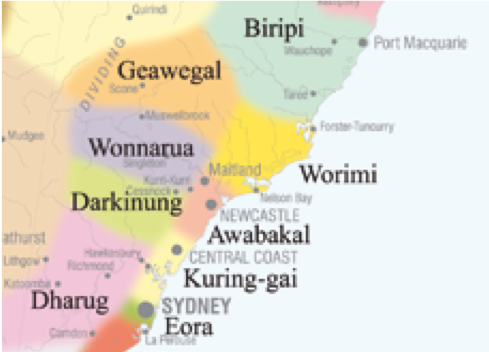

footer: [CS4S 2019 - AI Workshop](https://cs4s.github.com/2019/ai)

# Coding & STEM 4 Schools

## Introductions and Workshop Aims

### 2019 AI Workshop

### Presented by Mr Daniel Hickmott 

#### 12th November 2019

---

# This Land

We acknowledge and respect the Pambalong clan of the Awabakal people, traditional custodians of this land.

---

# Partners

Developed with support through: 

Thanks to their their [CS Educator PD](https://edu.google.com/computer-science/educator-grants/#!?modal_active=none) grants

Supported by staff from the School of Education here at UoN

---

# Introductions

I'm Elena

- I studied a Bachelor of Mathematics
- I studied a PhD in computer science at UoN
- I subsequently worked in Bioinformatics for a number of years
- Since 2012 I have worked in the School of Education

--- 

# Introductions

I'm Daniel

- PhD Candidate in School of Education
- Studying Teacher Professional Development for the Digital Technologies curriculum
- Completed my Software Engineering degree in 2014
- Facilitating workshops in this area since 2013

---

# Introductions

I'm Ben

- Final year of my Bachelor of IT at the University of Newcastle
- Majoring in Interactive Media
- Focussing on Media Production, Web Design and Development
- Interested in applying digital technologies in creative design, visual storytelling and virtual reality

---

# Introductions

- And you?

---

# Logistics

- Toilets
- Fire alarm
- Login

---

# Workshop Aims

- To be a practical and accessible introduction to *Machine Learning*
- Introduce some essential steps commonly used when creating *Machine Learning* solutions
- Explain different types of *Machine Learning* and things to consider when using *Machine Learning*
- Give you ideas and resources to explore these topics further

---

# Sessions (Morning)

- **Artificial Intelligence and Machine Learning**
	- Types of Machine Learning
	- Solving problems with Machine Learning
- **Training a Smart Assistant**
	- Machine Learning for Kids
	- Training a computer with examples

---
		
# Sessions (Before Lunch)

- **Representing Data and Identifying Features**
	- The importance of data
	- Identifying features when creating solutions
- **Journey to School**
	- Crowdsourcing data
	- Evaluating a model

---

# Sessions (Afternoon)

- **How do Computers See?**
	- Representing images
	- Image pre-processing
- **Rock, Paper, Scissors**
	- Taking pictures of examples
	- Creating a game

