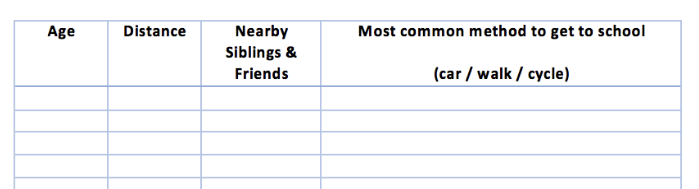
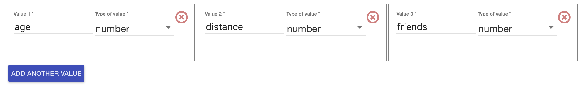

footer: [CS4S 2019 - AI Workshop](https://cs4s.github.com/2019/ai)

# Coding & STEM 4 Schools

## 2019 AI Workshop

### Journey to School

#### Presented by Mr Daniel Hickmott on 12th November 2019

---

# Journey to School

- Next, we will try the [Journey to School](https://projects.raspberrypi.org/en/projects/journey-to-school/) activity from the Raspberry Pi Foundation's Machine Learning projects resources
- This project uses examples with numbers instead of text
- We will aim to work through this together 
- Involves some data collection, which will be easier to do together

---

# The Students' Attributes

---

# Make Me Happy

- If we have time before the end of the session, we will try another activity
- The workshop is available as a pdf [from the worksheets page on Machine Learning for Kids website](https://machinelearningforkids.co.uk/#!/worksheets)