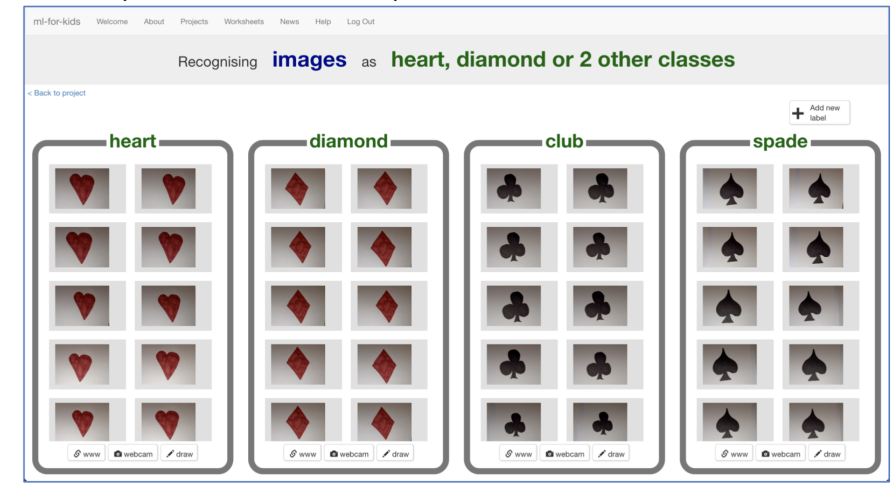

footer: [CS4S 2019 - AI Workshop](https://cs4s.github.com/2019/ai)

# Coding & STEM 4 Schools

## 2019 AI Workshop

### Snap!

#### Presented by Mr Daniel Hickmott on 12th November 2019

---

# Snap!

- Next, we will try the Snap! activity from the [Machine Learning for Kids Worksheets page](https://machinelearningforkids.co.uk/#!/worksheets)
- In this project you will make playing cards and take photos of them with the lab PC's webcam
- Then train a computer to recognise the suit of different cards
- Follow the instructions in the project worksheet that is 'For students:'

---

---

# Rock, Paper, Scissors

- If we have time before the end of the session, we will try another activity
- The workshop is available as a pdf [from the worksheets page on Machine Learning for Kids website](https://machinelearningforkids.co.uk/#!/worksheets)