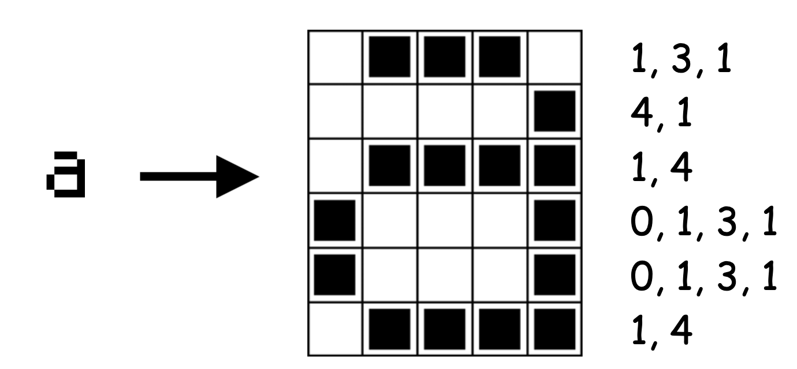

footer: [CS4S 2019 - AI Workshop](https://cs4s.github.com/2019/ai)

# Coding & STEM 4 Schools

## 2019 AI Workshop

### Computer Vision

#### Presented by Mr Daniel Hickmott on 12th November 2019

---

# What is Computer Vision?

- "A scientific field about how computers can be made to emulate human vision; in areas like face recognition and spatial awareness."[^1]
- Recent advances allow for a lot of opportunities:
	- The ease of taking many photos or video, e.g. drones with cameras
	- Increased processing power, e.g. [Snapchat filters on phones](https://www.youtube.com/watch?v=Pc2aJxnmzh0)

[^1]: [CS Field Guide: Computer Vision](https://csfieldguide.org.nz/en/chapters/computer-vision/)

---

[Google Street View cars](https://en.wikipedia.org/wiki/Google_Street_View)

---

# How Do Computers See?

- Need to have some way of 'seeing' e.g. video, photo or scanned document
- Usually images are represented as a list of individual colour values (for each pixel in the the image)

---

# Image Representation

[Computer Science Unplugged: Image Representation](https://classic.csunplugged.org/image-representation/)

---

 

[(195, 187, 185), (192, 184, 182), (189, 181, 179), (196, 188, 186), (203, 198, 195), (202, 197, 194), (194, 189, 186), (191, 186, 183), (186, 181, 178), (177, 172, 169), (199, 191, 188), (195, 187, 184), (192, 184, 182), (195, 187, 185), (200, 195, 192), (201, 196, 193), (196, 191, 188), (194, 189, 186), (189, 184, 181), (184, 179, 176), (203, 195, 192), (199, 191, 188), (193, 185, 182)...]

[CS Field Guide's Pixel Viewer](https://csfieldguide.org.nz/en/interactives/pixel-viewer/)

[.hide-footer]

---

# Applications of Computer Vision

- Computers can process many images very quickly and repetitively
- Used for surveillance at events with large numbers of attendees, e.g. [Superbowl](https://www.wired.com/2016/01/govs-plan-keep-super-bowl-safe-massive-surveillance/)
- Optical Character Recognition (OCR), e.g. [Google Translate](https://www.blog.google/products/translate/google-translates-instant-camera-translation-gets-upgrade/)
- Combined with drones for automating processes [livestock management](https://dronebelow.com/2019/08/28/automated-drones-to-monitor-cattle/)

---

# Recognising Faces

- A common application of Computer Vision is *facial recognition*
- Used a lot for identification (e.g. airports) 
- The Viola-Jones algorithm is used, [good high-level explanation here](https://www.youtube.com/watch?v=Pc2aJxnmzh0&t=1m21s)
- Algorithms can identify *attributes* of faces which we can then use in Machine Learning models, can you think of some examples of these *attributes*?

---

# Attributes of Faces

- Human face has appropriately 80 *nodal points*[^2], including:
	- Distance between eyes
	- Width of the nose
	- Depth of the eye sockets
	- The shape of the cheekbones
	- The length of the jaw line 

[^2]: [How Facial Recognition Systems Work](http://www.oamk.fi/~palo/iten1/19_%20EXTRA_Facial%20Recognition%20Systems.pdf)

---

# Challenges and Techniques

- The [Computer Vision](https://csfieldguide.org.nz/en/chapters/computer-vision/) chapter from the [CS Field Guide](https://csfieldguide.org.nz/en/) is a great resource for Computer Vision if you would like to know more:
	- [Noise and Filtering](https://csfieldguide.org.nz/en/chapters/computer-vision/noise/)
	- [Edge Detection](https://csfieldguide.org.nz/en/chapters/computer-vision/edge-detection/): splitting images up to detect different objects in the image, e.g. [Facebook tags](https://github.com/ageitgey/show-facebook-computer-vision-tags)

---

# Snap!

- Next, we will work through the *Snap!* activity from the worksheets available from the [Machine Learning for Kids website](https://csfieldguide.org.nz/en/chapters/computer-vision/noise/)
- In this activity we will teach a computer to recognise photos of hand-made cards as the correct suit (spades, clubs, hearts and diamonds)

