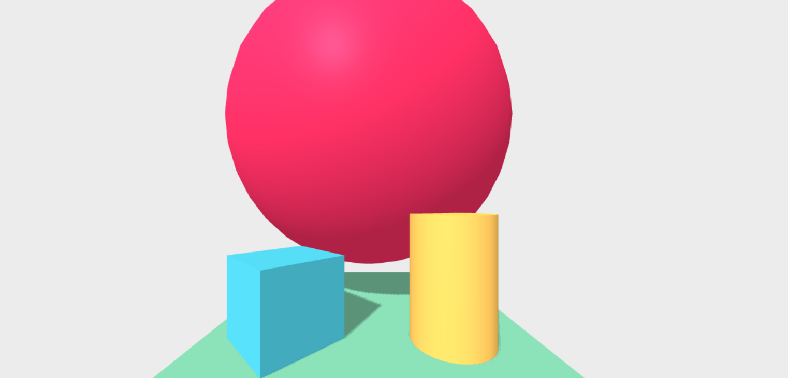

# {{ page.title }}

## Introduction

In this activity you will learn about the *Inspector* tool in A-Frame.
The *Inspector* tool shows a view of the VR scene that makes it easy to see all of the *entities* in our scene and make changes to the *entities*.
The tool can be particularly useful when we are trying to find *bugs* in our code or when *entities* don't appear in our scene as we expect them to.

The *Inspector* gives us a view of the scene that looks similar to some 3D editor software, such as [Blender](https://www.blender.org/){: class="text-info" target="_blank" } or [Unity](https://unity.com/){: class="text-info" target="_blank" }.

A screenshot of the *Inspector* open on the *Hello WebVR* scene is shown below:

<div class="row my-4">
    <div class="col-md-8 offset-md-2">
        
    </div>
</div>

We will explore some different VR scenes with the *Inspector* today and you will learn about a few key features of the *Inspector*.
If you would like to find out more about the *Inspector* tool, we recommend that you read the official documentation for the tool on the [A-Frame website](https://aframe.io/docs/0.9.0/introduction/visual-inspector-and-dev-tools.html#a-frame-inspector){: class="text-info" target="_blank" }.

## Opening the Inspector

The *Inspector* can be opened on any page that uses *A-Frame* by pressing *ctrl + alt + i* keys on your keyboard, at the same time.

The first step in this activity will be use the *Inspector* to view the *Hello WebVR* scene that we looked at in the last session. 
We will look at the version of the *Hello WebVR* scene in *A-Frame's Showcase* for this part of the activity, which is [available here](https://aframe.io/examples/showcase/helloworld/){: class="text-info" target="_blank" }.

Follow the *Hello WebVR* link above and open the *Inspector* by pressing the *ctrl + alt + i* keys.

When the *Inspector* is open, you can not enter *VR Mode* by clicking the <span class="enter-vr-container"><i class="fas fa-vr-cardboard enter-vr-icon"></i></span> button.
To return to back to the view where the <span class="enter-vr-container"><i class="fas fa-vr-cardboard enter-vr-icon"></i></span> is shown, you can click the *Back to Scene* button on the top left of the *Inspector*.

Once you have opened up the *Inspector* once, you can re-open it by pressing the *ctrl + alt + i* keys on your keyboard or by clicking the *Inspect Scene* button, which will be on the top left of the screen until the next time you refresh the page.

<div class="alert alert-light" role="alert">
  <strong>Note! the changes you that make in your scene will not take effect unless you edit the actual HTML</strong> (for example, in Glitch's Project Editor).
  You will learn how to make changes to your scene using the <i>Inspector</i> later in the activity.
</div>

## Using the Inspector

The *A-Frame Inspector* is a powerful tool that can be used to see how changes to the different *entities* in your scene will impact what your scene looks like.

The features of the *Inspector* include, but are not limited to:

- **Adding entities:** you can add new *entities* (for example, 3D shapes) to a scene
- **Exporting to GLB file**: you can download your scene as a 3D model in *.glb* format (which you could then view in another 3D editor)
- **Adjusting properties:**: you can make changes to an *entity's* properties (such as *scale* or *position*), which we will try out in the next part of this activity

Shapes, such as the *box* and *sphere* in our scene, and most of the other *entities* in A-Frame have a *position*.
We use 3D positioning for VR and, consequently, a *position* in *A-Frame* is 3 numbers: an x co-ordinate, a y co-ordinate and a z co-ordinate.

For example, in the code below we have a *box* entity that is in the *position* (-1, 0.5, -3).

```
<a-box position="-1 0.5 -3" rotation="0 45 0" color="#4CC3D9" shadow></a-box>
```

Note that the camera in *A-Frame* starts off by facing in the negative z direction, unless we change its *rotation*.
That is why all of the *entities* in the *Hello WebVR* have a negative z co-ordinate.

There are also properties that affect an entity's size and their *rotation*, which all consist of three numbers.
The main properties of entities that we will explore today are:

- **position:** where in the 3D co-ordinate system the *entity* is positioned.
- **rotation:** we can change how the *entity* is rotated. For example, look at the code for the box above and explore what happens when you change the values in the *rotation* property
- **scale:** how big the *entity* is. Note that you can change the *scale* across the three different *axes* (x, y, and z)

We will show you some ways of changing these properties on an entity through the *Inspector*.
Note that you can use the helpers at the top of the *Inspector*, which are pictured below, to change the property that is affected by dragging the arrows on an entity 

<div class="row my-4">
    <div class="col-md-8 offset-md-2">
        
    </div>
</div>

We used the *Inspector* to view all of the *entities* in one of the projects from the *A-Frame Showcase* - the *Hello WebVR* project .
However, the *A-Frame Showcase* has a a variety of projects - not just the *Hello WebVR* scene.
Some of the other projects from the *A-Frame Showcase* that you may want to view in the *Inspector* are:

- [Hello Metaverse](https://aframe.io/examples/showcase/hello-metaverse/){: class="text-info" target="_blank" }
- [360° Image](https://aframe.io/examples/showcase/sky/){: class="text-info" target="_blank" }
- [Animation](https://aframe.io/examples/showcase/animation/){: class="text-info" target="_blank" }

The projects in the *A-Frame Showcase* use a variety of different types of shapes and vary in their complexity.

See if you can make some changes to those projects, such as the *position* and *scale* of entities, using the *Inspector*.
You may also want to try changing other properties (not just *position*, *rotation* and *scale*) as well, such as the text that's displayed in the [360° Image](https://aframe.io/examples/showcase/sky/){: class="text-info" target="_blank" }.
The [Animation](https://aframe.io/examples/showcase/animation/){: class="text-info" target="_blank" } project includes animations that make the spheres move back and forward in that scene.
You could try and see what happens when you change the properties of the *animation* components in that project as well.

## Making Changes to the Scene

The changes that we make in the *Inspector* do not take effect permanently unless we change the actual HTML itself.
If we just make the changes in the *Inspector*, the scene will revert back to how it looked before we made changes in the *Inspector* as soon as we refresh the page.

In this part of the activity, we will make some changes in the *Inspector* and also make these changes in the *Glitch* project editor.

The first step is to **remix the official [A-Frame Starter Project](https://glitch.com/~aframe){: class="text-info" target="_blank" }**.
You can *remix* the project by clicking the *Remix Your Own* button.
You might also like to rename the project to make the title shorter, as we did in the last activity.

You should now have your own version of the *Hello WebVR* scene open in the *Glitch* *Project Editor*.
The example we have included to show how to make changes from the *Inspector* in the *Glitch* project involves changing the position and size of the sphere in the *Hello WebVR* scene.
However, you are welcome to make whatever changes you would like to the scene by following similar steps.

We are going to move the red sphere so that is above the cylinder and box shapes and we are also going to increase its size.
The end result will look similar to the image below:

<div class="row my-4">
    <div class="col-md-8 offset-md-2">
        
    </div>
</div>

**The first step is to move the red sphere so that it is above the other shapes.**

You may want to view your scene in a new tab by clicking the *Show* button in *Glitch* and then selecting the *In a New Window* option.
However, you can view the website within the editor by selecting the *Next to The Code* option instead, if you prefer that view.
Once you are viewing the scene, open the *Inspector* by pressing *ctrl + alt + i* on your keyboard.

You can change the position by dragging the arrows on an entity when the *translate* (<i class="fas fa-expand-arrows-alt"></i>) helper is selected.
The changing of the position for the different axes are demonstrated in the animation shown below. 

<div class="row my-4">
    <div class="col-md-8 offset-md-2">
        
    </div>
</div>

Note that, as can be seen in the animation above, the values for the corresponding axis change in the *position* section of the right pane when the *position* of the sphere changes.

You can move the sphere to any *position* that you like but in our example we have moved the sphere upwards so that is it has a y-coordinate of 4.

Our next step is to make the change to our HTML page that we made in the *Inspector* so that the sphere is still above the other shapes when we refresh the page.
There are a couple of ways to make the change but they all involve changing the actual webpage (which is the *index.html* file in our *Glitch* project).

If we are only making a change to one of the *entity's* *properties* (for example, the *position*) then a simple way to make this change is just to edit the property in the HTML tag, as demonstrated in the animation below.

<div class="row my-4">
    <div class="col-md-8 offset-md-2">
        
    </div>
</div>

On the other hand, if we are making several changes to an *entity*, it is probably quicker for us to use the *Copy entity HTML to clipboard* feature in the *Inspector* and use that copied HTML to replace the *entity's* tag in our HTML.

An example of how you can change the sphere's *position* and then use the copied HTML to update the *index.html* file with the *Glitch* *Project Editor* is shown in the animation below:

<div class="row my-4">
    <div class="col-md-8 offset-md-2">
        
    </div>
</div>

I completed the following actions in the animation above:

1. Changed the position of the sphere in the *Inspector*
2. Copied the code for the sphere with the *Copy entity HTML to clipboard* button in the *Inspector*
3. Removed the tags for the sphere in the *index.html* page in the *Glitch* *Project Editor*
4. Pasted the code for the sphere in the higher position into *index.html* in the *Glitch* *Project Editor*
5. Refreshed the page so that the changes to the *index.html* page took effect

Note that *Glitch* projects will normally automatically refresh after you make changes to the HTML. 
We switched that feature off for the demonstration in the animation above.

You may have noticed that when you adjust the *positions* of *entities* in the *Inspector*, the coordinates in the copied HTML are given to 5 decimal places.
In the example with the sphere, we probably don't need to be that precise.
We can remove the decimal places in the *position* and the scene will still look very similar, as shown in the animation below:

<div class="row my-4">
    <div class="col-md-8 offset-md-2">
        
    </div>
</div>

If you have followed those steps above, the sphere should now be positioned above the other shapes.

**The next step is to increase the size of the sphere.**

We can increase the size of the sphere in the scene by using the *Inspector* as well.
Open up the *Inspector* with the *ctrl + alt + i* keys, like you did during the last part of the activity.

It is possible to use the *scale* helper at the top of the *Inspector* and then drag the arrows to scale up the sphere but we are going to edit the values directly instead.
We are going to scale up the sphere to be 2 times bigger on the x, y and z axes.

To do this, change each of the values in the *scale* section from 1 to 2, as demonstrated in the animation below:

<div class="row my-4">
    <div class="col-md-8 offset-md-2">
        
    </div>
</div>

The next step is to copy the HTML from the *Inspector* and replace the &lt;a-sphere&gt; tag with the copied HTML. This step is shown in the animation below:

<div class="row my-4">
    <div class="col-md-8 offset-md-2">
        
    </div>
</div>

I completed actions that were similar to the repositioning of the sphere in the above animation:

1. Copied the code for the sphere with the *Copy entity HTML to clipboard* button in the *Inspector*
2. Removed the tags for the sphere in the *index.html* page in the *Glitch* *Project Editor*
3. Pasted the code for the scaled up sphere in the *index.html* in the *Glitch* *Project Editor*
4. Refreshed the page so that the changes to the *index.html* page took effect

Hopefully, you followed those steps above (or similar steps) for repositioning and scaling up the sphere.
After you have completed those steps, the sphere and be scaled up to be 2 times bigger on the x, y and z axis.

If you have time before we move onto the next activity, try moving and changing the other shapes in the *Hello WebVR* scene and then changing the *index.html* page so that the changes you made in the *Inspector* are preserved.
You could also try moving one or more of the shapes so that they are behind the camera.
Note, that the camera starts by facing in the negative z direction, so shapes should have a position with a positive z coordinate if you want them to be behind the camera.

## Next Steps

In the next activity, you will learn about the different shapes can be added to *A-Frame* scnes and you will use your knowledge of positioning to combine multiple shapes in one scene.

[Back to Session Page](./){: class="btn btn-outline-info session-nav-button" }