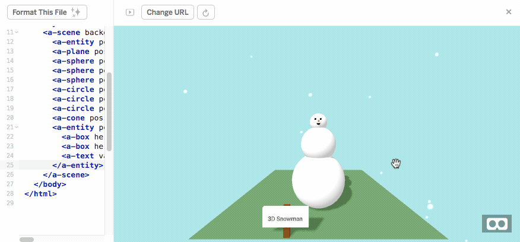

# {{ page.title }}

## Introduction

In this activity you will learn about the different shapes that you can add to your *A-Frame* scene.

You will also learn how to add text to a scene and how *relative positioning* works.

## Shapes in A-Frame

There are several shapes that can be added to an *A-Frame* scene with specific HTML tags.
Each of these shapes have *position*, *rotation* and *scale* properties.
There are also some other properties (such as *color*) which are available on all of the shapes as well.

Each of the shape tags have different properties, which affect their size and appearance.
You may have noticed the different properties on the different shapes in the *Hello WebVR* scene.
Some examples of the shapes in *A-Frame* and their *properties* (in italics) are:

- **box:** this draws a box (a rectangular prism) with a given *width*, *height* and *depth*
- **sphere:** this draws a sphere with a given *radius* (and you can also adjust the sphere to draw only segments - like a Pacman shape - with the *phi-start*, *phi-length*, *theta-start* and *theta-length* properties)
- **ring:** this draws a ring (a circle with a hole in the middle), for a given *radius-inner* for the radius of the inner hole of the ring and *radius-outer* for the radius of the outer edge of the ring
- **cone:** this draws a cone with a given *radius-bottom* for the radius of the bottom of the cone, a given *radius-top* for the radius of the top of the cone and a given *height*

You can use each of these shapes within an *A-Frame* scene by using a tag that begins with *a-* (for example, the &lt;a-ring&gt; tag for a ring shape and the &lt;a-cone&gt; tag for a cone shape).

The code below would adds a cone shape with a radius of 0.5 on the bottom, a radius of 0.1 on the to and height of 1.5 to a scene.

```
<a-cone position="1 0.75 -3" color="tomato" radius-bottom="0.5" height="1.5" radius-top="0.1" shadow></a-cone>
```

A screenshot of the cone, in place of the cylinder in the *Hello WebVR* scene is shown in the below image:

<div class="row my-4">
    <div class="col-md-4 offset-md-4">
        
    </div>
</div>

You can read more about the different shapes that you can use in A-Frame on the [Geometry Component's Documentation Page](https://aframe.io/docs/0.9.0/components/geometry.html){: class="text-info" target="_blank" }.

The different properties of shapes (like a cylinder's *radius* or *height*) can be adjusted through the *Inspector* as well, as shown in the animation below:

<div class="row my-4">
    <div class="col-md-8 offset-md-2">
        
    </div>
</div>

Try adding some of the different shapes to your scene and see what happens when you change the different *properties* of the shapes (either through HTML or the *Inspector*).

If you add some shapes to your scene in HTML but you can't see them in your scene, you may have to check where they are positioned with the *Inspector*.
You can then reposition the shapes using the same steps for repositioning that you used in the last activity.

## Build a Snowman

Now, you are going to use your knowledge of shapes in *A-Frame* to build a VR snowman.

The end result will look something like the snowman in the image below:

<div class="row my-4">
    <div class="col-md-4 offset-md-4">
        
    </div>
</div>

To get started on this activity, you should first remix the [Snowman Starter Project](https://glitch.com/~cs4s-snowman-starter){: class="text-info" target="_blank" } that we have created with *Glitch*.

You may want to have a look at the code that is in the original project before making any changes.
You may notice that there is an animation of falling snow in the background of our scene.
There are two lines in the project in the *index.html* webpage that make this animation happen.

This line below brings in some code from a *component* called [aframe-particle-system-component](https://github.com/IdeaSpaceVR/aframe-particle-system-component#readme){: class="text-info" target="_blank" }:

```
<script src="https://unpkg.com/aframe-particle-system-component@1.0.11/dist/aframe-particle-system-component.min.js"></script>
```

A *component* is code that has someone else has written, which we can use to add more features to our *A-Frame* scene.
If you would like to find out about more *components*, you can find a curated collection of *components* for *A-Frame* at the [A-Frame Registry](https://aframe.io/aframe-registry/){: class="text-info" target="_blank" }.

This line below adds a particle system (the falling snow) to our scene:

```
<a-entity position="0 2.25 -15" particle-system="preset: snow"></a-entity>
```

We have used the *snow* *preset* of the *component* for the starter project but there are few different presets to choose from. 
You could try changing the *snow* in the particle system's &lt;a-entity&gt; tag to *dust* and *rain* and see what happens.

Once you have had a look at the code in the *index.html* page of the *Snowman Starter Project*, you can get stuck into building your snowman.

If you get stuck, you can use the following code snippet to add the base of your snowman to the scene.

<p>
  <button class="btn btn-outline-info collapsed" type="button" data-toggle="collapse" data-target="#collapse-difference-2" aria-expanded="false" aria-controls="collapseExample">
    <span class="if-not-collapsed">
        Hide Code Snippet
        <i class="fas fa-chevron-up step-icon"></i>
    </span>
    <span class="if-collapsed">
        Show Code Snippet
        <i class="fas fa-chevron-down step-icon"></i>
    </span>
  </button>
</p>
<div class="collapse" id="collapse-difference-2">
  <div class="card card-body my-4">
    <p>The code below will add a white sphere with a <i>radius</i> of 0.6 to your scene, which you could use as the base of your snowman.</p>
    <div class="highlighter-rouge">
        <div class="highlight">
            <pre class="highlight"><code>&lt;a-sphere position="0 0.6 -3" radius="0.6" color="white" shadow&gt;&lt;/a-sphere&gt;</code></pre>
        </div>
    </div>
  </div>
</div>

The snowman should be built by using three white spheres that get smaller in size as the snowman gets taller.

If you finish building your snowman quickly, you could use other shapes to add features (like eyes, a mouth or nose) to your snowman.
For example, the snowman in the animation below has two eyes (two circle shapes), a mouth (a circle shape with *thetaLength* of 180) and a nose (a cone shape).

<div class="row my-4">
    <div class="col-md-4 offset-md-4">
        
    </div>
</div>

## Add a Sign

In the last part of the activity, we have positioned shapes in the scene by using *absolute* positions that are specific points in the scene.

In this part of the activity we are going to create a sign for our snowman by grouping shapes together and using *relative positioning*.
When we group together shapes and use *relative positioning*, it easy for us to put multiple groups of shapes (for example,the snowman that we just built) in different parts of our scene.

Copy and paste the snippet below into your Snowman project (remember that our *A-Frame* tags have to be inside of the &lt;a-scene&gt; and &lt;/a-scene&gt; tags!)
```
<a-entity position="-0.5 0.25 -2">
    <a-box height="0.5" width="0.1" depth="0.05" position="0 0 -0.05" color="#784212" shadow></a-box>
    <a-box height="0.3" width="0.7" depth="0.05" position="0 0.1 0" shadow></a-box>
    <a-text value="3D Snowman" align="center" color="black" position="0 0.1 0.05" width="2"></a-text>
</a-entity>
```

When you view your webpage, you should now see a sign for the snowman in the scene, as can be seen in the image below:

<div class="row my-4">
    <div class="col-md-8 offset-md-2">
        
    </div>
</div>

The positions used in the different shape tags are all *relatively positioned* with the parent *entity*.
This means that we can easily copy the shapes and add them to another spot.

Let's say that we want to have another sign to the right of our '3D Snowman' sign that says 'Built in A-Frame'.
We can do this by copy/pasting the tags for the sign above and changing some of the properties in our HTML, as demonstrated in the animation below:

<div class="row my-4">
    <div class="col-md-8 offset-md-2">
        
    </div>
</div>

In the animation above, I:

1. Copied the tags that created the '3D Snowman' sign
2. Pasted these tags after the closing &lt;a-entity&gt; tag in the *index.html* file
3. Changed the x coordinate of the sign's *position* so that it was 0.5 instead of -0.5
4. Changed the value of the text so that the new sign now says 'Built in A-Frame' instead of '3D Snowman'

Note that I changed the setting that makes the webpage automatically refresh for the animation above, so these steps may work slightly different if you make similar changes to your project.

If the shapes were not grouped together and did not use *relative positioning*, we would have to adjust the *positions* of all of the *entities* (the two boxes and the text entity) rather than just the *position* of the parent entity.

In the animation above, we changed what the text in our scene said (the *value* property) but it is also possible to change other properties, including the *color*, *size* and *font* used for the text.
You can find out more about how you can display text in *A-Frame* from the [Text Component's Documentation Page](https://aframe.io/docs/0.9.0/components/text.html){: class="text-info" target="_blank" }.

<div class="card border-info my-4">
<div class="card-header">Positioning Shapes in A-Frame: Challenges</div>
<div class="card-body">
    <h5 class="card-title">Challenges:</h5>
    <ul>
        <li>Use different fonts for the sign (you can see details about the 'stock' fonts available in A-Frame <a href="https://aframe.io/docs/0.9.0/components/text.html#stock-fonts" class="text-info" target="_blank">on this page</a>)</li>
        <li>Change the colour of the snow falling in the scene</li>
        <li>Change the colours of the boxes and text used for the sign</li>
        <li>Change the size of the signs</li>
        <li>Add more signs to your scene</li>
        <li>Change the snowman to be a group of shapes that are <i>relatively positioned</i></li>
        <li>Add more snowmen to your scene</li>
    </ul>
</div>
</div>

Nice work, you have completed the <i>{{ page.title }}</i> activity!
In the next session you will learn about 3D images and models and how to include these in your *A-Frame* scenes.

[Back to Activities Page]({{ site.baseurl | append: '/vr/activities'}}){: class="btn btn-outline-info session-nav-button" }