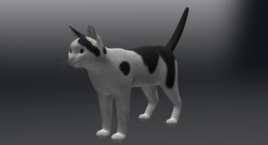
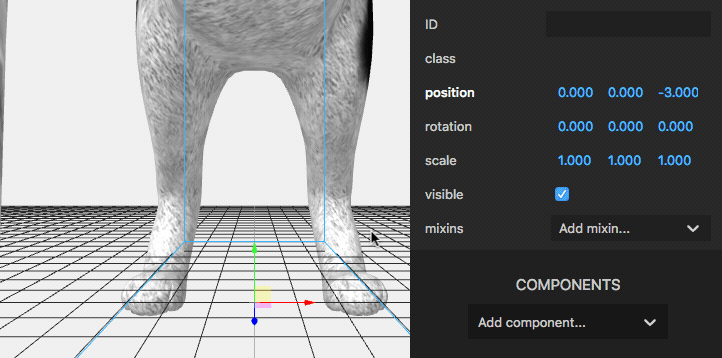
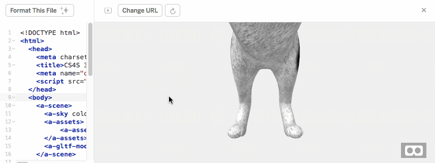
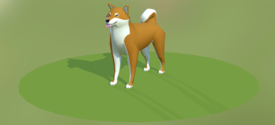
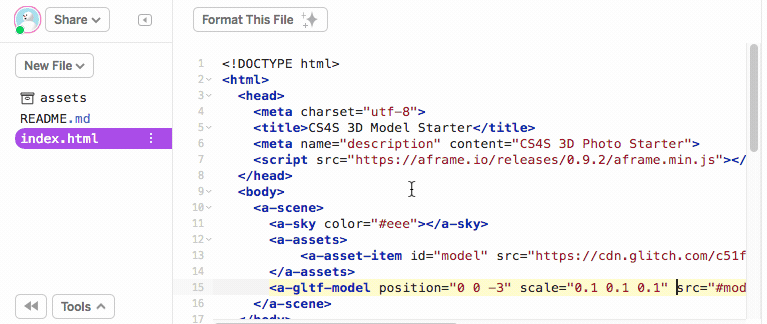
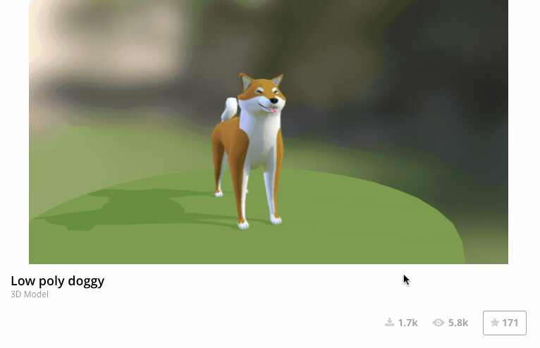
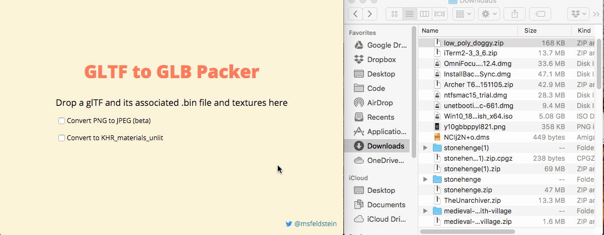
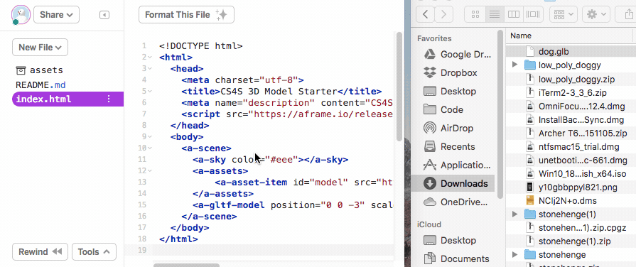
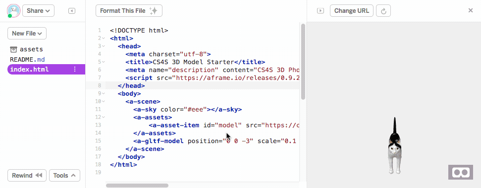

# {{ page.title }}

## Introduction

In this activity you will learn about the types of 3D models that are commonly used in VR apps and how to add a 3D model to an *A-Frame* scene.

The scenes that are in professional VR apps, like games, often include many  3D models.
Developers of those apps usually have to buy or create the 3D models they use in their scenes.
Luckily, there are some websites, which we will look at today, that we can use to download free 3D models for our VR scenes.

## 3D Models

3D models are usually created in a 3D editor, such as [Blender](https://www.blender.org/){: class="text-info" target="_blank" }, [Autodesk Maya](https://www.autodesk.com/products/maya/overview){: class="text-info" target="_blank" } or [Sketchup](https://www.sketchup.com/){: class="text-info" target="_blank" }.
We will not learn about these editors in this workshop, but you can find out more about them from their respective websites.

There are also apps that allow you to create models within VR, such as [Google Blocks](https://arvr.google.com/blocks/){: class="text-info" target="_blank" } and [Oculus Medium](https://www.oculus.com/medium/?locale=en_GB){: class="text-info" target="_blank" }.

There are different types of 3D model files, including OBJ, COLLADA, STL, gLTF and GLB files.
Different 3D model editors will export different types of 3D model files.
We will focus on gLTF and GLB files in this workshop. 

There are several websites that have large collections of 3D model files that are available to download, such as [3D Warehouse](https://3dwarehouse.sketchup.com/){: class="text-info" target="_blank" }, [SketchFab](https://sketchfab.com/){: class="text-info" target="_blank" } and [Google Poly](https://poly.google.com/){: class="text-info" target="_blank" }.
Some of the 3D models on these websites will cost money but, luckily, some model creators make their models available for free download.

## GLTF Models in A-Frame

The first step of the activity is to remix the [Model Starter Project](https://glitch.com/~cs4s-model-starter){: class="text-info" target="_blank" } that we have created for this workshop.

The scene in this project includes a 3D model of [a cat created by 
liye.yan1994](https://sketchfab.com/3d-models/cat-husa-e1f996075ece4f26855879eaaae17790){: class="text-info" target="_blank" }, which we downloaded from the [SketchFab](https://sketchfab.com/){: class="text-info" target="_blank" } website.

The cat model looks like this in the *SketchFab* model viewer:

<div class="row my-4">
    <div class="col-md-6 offset-md-3">
        
    </div>
</div>

When you first view in the scene in the *Glitch* project, you may notice that we don't have a very nice view of the cat model.
We will fix the view of the cat soon, but first we will highlight some important lines of code in this project's *index.html* file.

This line below tells *A-Frame* to load the *GLB* file for the cat model that is in the project's *assets* folder.
The &lt;a-asset-item&gt; tag is used for adding 3D models and materials as *assets* in our projects.

```
<a-asset-item id="cat-model" src="https://cdn.glitch.com/c51f928e-e18c-461b-80a9-65e9ee1d42bf%2Fcat.glb"></a-asset-item>
```

The link in the *src* property is a link to our cat model file and we have given this *asset* the id 'model'.

This line below tells *A-Frame* to load the model with the id 'model' into our scene.

```
<a-gltf-model position="0 0 -3" src="#model"></a-gltf-model>
```

We have also positioned the cat at (0,0,-3) in the line above.

Now, let's improve our view of the cat model.

It is common to find that models downloaded from *SketchFab* and similar websites are very big when they are loaded in an *A-Frame* scene.
We can adjust the size of a 3D model with the *scale* property, like we can with 3D shapes.

You can use the *Inspector* to help you find a suitable *scale* to use for changing the size of the cat model.
The animation below shows how you can adjust the *scale* of the model in the *Inspector*.

<div class="row my-4">
    <div class="col-md-8 offset-md-2">
        
    </div>
</div>

Once you have found a suitable *scale* to use, you will probably want to add the *scale* property and number in the &lt;a-gltf-model&gt; tag in the *index.html* file, as shown in the animation below:

<div class="row my-4">
    <div class="col-md-8 offset-md-2">
        
    </div>
</div>

Note that you can adjust the *position* and *rotation* of a 3D model as well, like we can with 3D shapes.

## Downloading a Model

In the next part of the activity, you will replace the cat model with a 3D model of your own choosing.

We have chosen to use the [Low poly doggy model created by Joe McDowall](https://sketchfab.com/3d-models/low-poly-doggy-1c8c763518ab4751bfcddf0b6a34011a){: class="text-info" target="_blank" } from the *SketchFab* website, which is shown in the image below, as an example:

<div class="row my-4">
    <div class="col-md-6 offset-md-3">
        
    </div>
</div>

Before we add a different model, it is probably best to remove the cat model, which is in the assets folder.
The animation below shows the deletion of the cat model from the *assets* folder:

<div class="row my-4">
    <div class="col-md-8 offset-md-2">
        
    </div>
</div>

In the animation above, I:

1. Clicked on the *assets* folder to view the *assets* in my project
2. Clicked on the *cat.glb* file, which is the cat model file
3. Clicked the *Delete* button
4. Confirmed that I wanted to delete the model

Note that, unlike the photo we used in the last activity, we cannot see a preview of what our model looks like in the *assets* folder.
It is best to use an appropriate name for the model file that we add as an asset (for example, *cat* for our cat model) so we don't get confused when we have many models in our *assets* folder.

There are a variety of different websites that you can download 3D models from (or you could even make your own).
For this activity, we recommend using [SketchFab](https://sketchfab.com/search?sort_by=-pertinence&type=models){: class="text-info" target="_blank" } for finding the 3D model you will add to your scene.

You will have to register a *SketchFab* account and log into this account before downloading 3D models. 
You can sign up to a *SketchFab* account with your email or use your existing *Facebook*, *Google* or *Twitter* account.
If you are a teacher at a NSW Department of Education school (or if your school uses Gmail for managing email), then you may be able to use your department email and password when logging into Google for the *log in with Google* option.

When searching for models on *SketchFab*, **you should click the Downloadable button** to filter out the models that can't be downloaded.

Once you have found a model that you would like to add to your scene, you can download the model by clicking the *Download 3D Model* button on the model page, as shown in the animation below:

<div class="row my-4">
    <div class="col-md-8 offset-md-2">
        
    </div>
</div>

**You should select the Autoconverted format (gLTF) option when dowloading your model for this activity**.

The model will be downloaded in a ZIP file, which will contain our 3D model (gLTF file) and some textures (images).

## Uploading a Model

The easiest way to use our 3D model in *Glitch* with *A-Frame* is by converting the model files downloaded from *SketchFab* to a GLB model.
A GLB model is a single file (with the extension .glb) that includes a model and its textures.

We will use the [GLB Packer](http://glb-packer.glitch.me/){: class="text-info" target="_blank" } project on *Glitch* to convert the model we downloaded into GLB format.

The first step is to extract the ZIP file that we downloaded from *SketchFab*.
We then drag the extracted file into the *GLB Packer* website, as shown in the animation below:

<div class="row my-4">
    <div class="col-md-8 offset-md-2">
        
    </div>
</div>

We recommend renaming the file that is exported from the project to something more meaningful than *out.glb*.
For example, we renamed the downloaded model file from *out.glb* to *dog.glb*.

We will now upload the GLB model to *Glitch*.
This is a similar process to uploading the photo in the last activity.
You can drag the GLB file into the *assets* folder of the project from your *Downloads* folder and it will be uploaded to your project, as can be seen in the animation below:

<div class="row my-4">
    <div class="col-md-8 offset-md-2">
        
    </div>
</div>

## Changing the Model

Our next step is to change the source of the *asset* with the id 'model' so that it loads the model that you uploaded, instead of the cat model.

First, you need to copy the address of the model in the *assets* folder.
Then, you will use this address to replace what is in the *src* tag of the &lt;a-asset-item&gt; tag.
Note that the end part of the address (starting from the ? character) has to be removed for the model to load properly.
These steps are shown in the animation below:

<div class="row my-4">
    <div class="col-md-8 offset-md-2">
        
    </div>
</div>

The model that you uploaded should now appear in place of the cat model.
You might find that the model is very large or small.
Or you might find that the model is positioned so that is facing away from the camera, like our dog model in the above animation.
You might have to adjust the *rotation*, *scale* or *position* of the model in the scene for it to appear nicely in your scene.

Nice work, you have completed the <i>{{ page.title }}</i> activity!
In the next session you will learn how to include interactions and animations in your scene.

[Back to Session Page](./){: class="btn btn-outline-info session-nav-button" }