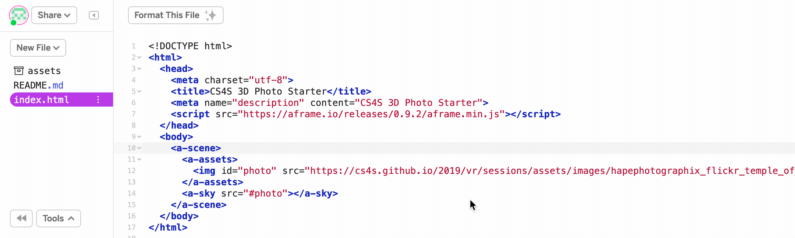

# {{ page.title }}

## Introduction

In this activity you will learn about *equirectangular images* and how to create your own 3D Photo viewer with *A-Frame*.

Using VR headsets for the viewing of 3D photos is fairly common, particularly with low-end VR headsets like the *Google Cardboard*. 
Viewing 3D photos in VR can make us feel like we really were at the spot the photo was taken, as we can get a 360 degree view of the photo.

As you will find out in this activity, it is pretty easy to create a 3D photo viewer with *A-Frame*, once we have found a suitable *equirectangular* image to use.

## Equirectangular Images

An *equirectangular image* usually refers to a 2D representation of an image that maps to a cylinder or sphere. A common example of an *equirectangular image* is a map of Earth.
A map of Earth is a 'flattened' version of a 3D representation because the Earth is a spherical shape.

[You can see an example of an *equirectangular image* here](images/hapephotographix_flickr_temple_of_heaven.jpg){: class="text-info" target="_blank" }, which is a photo of the Temple of Heaven in Beijing, China.
This photo was taken by the flikr user [hapePHOTOGRAPHIX](https://www.flickr.com/photos/hapephotographix/){: class="text-info" target="_blank" } and downloaded from flickr.

It is possible to take *equirectangular* photos with a normal camera or phone (for example, using the *Photo Sphere* feature on Android phones or the *Pano* feature in the iOS Camera app).
However, the easiest way to capture 3D photos is with a camera that takes 360 degree photos.

In this activity, we are going to use *equirectangular images* when creating our 3D photo viewer.

## The Sky Tag in A-Frame

The first step in this activty is to remix the [3D Photo Starter Project](https://glitch.com/~cs4s-photo-starter){: class="text-info" target="_blank" } that we have created for this workshop.

You may want to try viewing this page on one of the provided *Cardboard* or *Oculus* headsets.
The project uses the *equirectangular image* that is linked above, so you should see a 360 degree view of the Temple of Heaven when viewing the webpage.

Let's have a look at the code in the *index.html* page before we make any changes.
There are two main parts in the *index.html* that make the photo appear in a 360 degree view.

In this first part, these lines below tell *A-Frame* to find the image at the given web address and load it as an *asset* with the id 'photo':

```
<a-assets>
    
</a-assets>
```

In this second part, this line below tells *A-Frame* to use the asset with the 'photo' id as the scene's sky:

```
<a-sky src="#photo"></a-sky>
```

The Sky tag (&lt;a-sky&gt;) in *A-Frame* is used to show a 360 degree image or to set the background colour of a scene.
If you would like to find out more about this tag, there is more information about it on the *A-Frame* website, on the [Sky Primitive's Documentation page](https://aframe.io/docs/0.9.0/primitives/a-sky.html){: class="text-info" target="_blank" }.

## Changing the Photo

We have used the photo of the Temple of Heaven in our starter project but you can use any *equirectangular image* that you like for your photo viewer.

In this part of the activity, you will learn how to upload a different photo and view it in 3D.

Before you upload an image, you will have to find a suitable photo.
We recommend finding and downloading photos from one of the *equirectangular photos* flickr groups.
There are two flickr groups that we recommend: the [360° Images for Schools group](https://www.flickr.com/groups/360images4schools/){: class="text-info" target="_blank" } and the [Equirectangular group](https://www.flickr.com/groups/equirectangular/pool/with/31405306627/){: class="text-info" target="_blank" } (which has many more photos than the first group but some of them cannot be downloaded or are not licenced under *Creative Commons*).

The animation below shows how to download an image from flickr, using the download button.
We recommend that you choose the largest image size available for download, as bigger sizes will look the best in 3D.

<div class="row my-4">
    <div class="col-md-8 offset-md-2">
        
    </div>
</div>

In this example, I am going to use another photo for the scene.
The photo is a 360 degree view of [a town square in Wroclaw in Poland](https://www.flickr.com/photos/rueike/14946815001/in/photolist-oLNkmV-oMV6EM-oTzdfi-8LtGrQ-ov4ddt-oymNnE-oxuLFJ-owBRiv-oQUMGp){: class="text-info" target="_blank" }, which was taken by the flickr user [Rick](https://www.flickr.com/photos/rueike/){: class="text-info" target="_blank" }.

We can upload images to our *Glitch* project with the *assets* feature.
To view the *assets* in your projects, click the *assets* button (with the <i class="fas fa-archive"></i> icon) in the left pane.
To upload your photo, click the *Upload an Asset* button and select the relevant file.
Alternatively, you can drag the image file from your Downloads folder into the assets section of your project, as shown in the animation below:

<div class="row my-4">
    <div class="col-md-8 offset-md-2">
        
    </div>
</div>

Note that the above steps were followed on a Mac computer and will look a bit different to the lab computer.
However, the steps are very similar on a Windows computer.

Once you have uploaded a photo, it should appear in the *assets* folder, like it does at the end of the above animation.

Next, we will replace the web address for the old photo (the Temple of Heaven) with the photo that you uploaded to *Glitch* in the *index.html* file.

You can get the web address of your new photo by clicking on the image in the *assets* folder and then clicking the *copy* button, as shown in the animation below:

<div class="row my-4">
    <div class="col-md-8 offset-md-2">
        
    </div>
</div>

Next, you should replace the address (in the *src* property) for the previous photo with the address of the *asset* you just copied.
This is shown in the animation below:

<div class="row my-4">
    <div class="col-md-8 offset-md-2">
        
    </div>
</div>

Once you have made that change to the address and your webpage has refreshed, you should now see your photo in 3D.
Try it out on your phone and a *Cardboard* headset or one of the provided *Oculus* headsets.

<div class="card border-info my-4">
    <div class="card-header">Creating a 3D Photo Viewer: Challenges</div>
    <div class="card-body">
        <h5 class="card-title">Challenges:</h5>
        <ul>
            <li>Use your phone's camera to take a 360 degree photo of the computer lab and put that in your photo viewer</li>
            <li>Have a look at <a href="https://glitch.com/~aframe-gallery" class="text-info" target="blank">this project</a>, which allows you to switch between different 360 degree photos. Can you remix and modify that project to use photos that you have taken or downloaded?</li>
        </ul>
    </div>
</div>

In the next activity you will learn how to include 3D models in your scene.

[Back to Activities Page]({{ site.baseurl | append: '/vr/activities'}}){: class="btn btn-outline-info session-nav-button" }