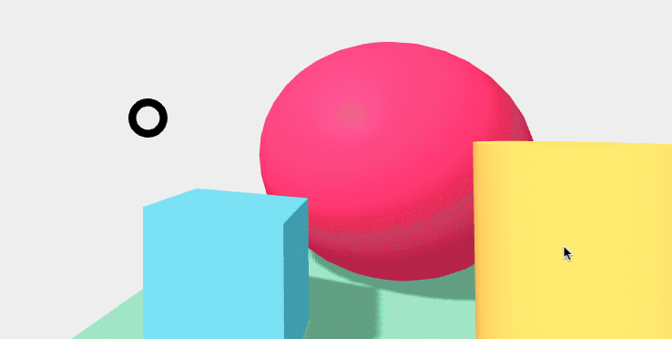
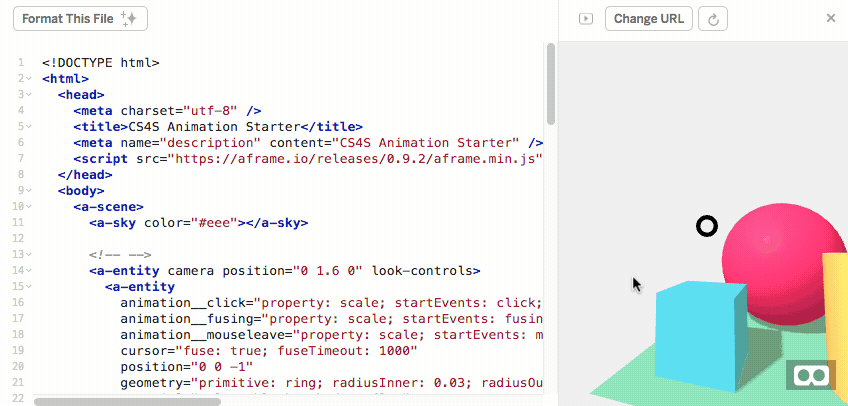
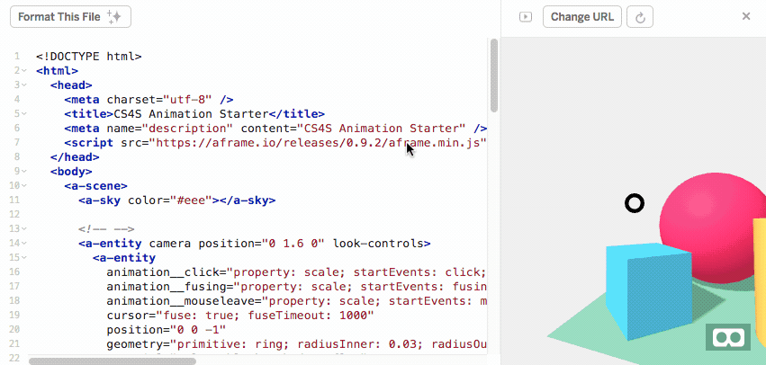

# {{ page.title }}

## Introduction

In this activity, you will learn how to animate *entities* in *A-Frame*.

We will only look at a couple of basic features of the animation *component* in today's workshop.
If you are interested in learning about more advanced animation techniques, we recommmend reading the [Animation Component's Documentation](https://aframe.io/docs/0.9.0/components/animation.html){: class="text-info" target="_blank" } on the *A-Frame* homepage.

## The Animation Project

We have created an [Animation Starter Project](https://glitch.com/~cs4s-animation-starter){: class="text-info" target="_blank" } to demonstrate how you can use animations in *A-Frame*. 
Unlike the last project, this project does not have a *scripts.js* file.
The first step of this activity is to open up that starter project and remix it.

You may want to try viewing the scene on a headset before we look at the code in more detail.
What happens when you look at the different shapes in the scene?

The *cursor* (the black ring in the middle of the screen) will shrink and then go back to normal size after you look at a shape for a couple of seconds, like it did in the *Interaction Starter Project*.
You may notice that the box shape rotates whenever you look at it for a couple of seconds, as can be seen in the animation below:

<div class="row my-4">
    <div class="col-md-4 offset-md-4">
        
    </div>
</div>

The other shapes do not move at all when you 'click' on them.
In the next step of the activity, we will add some code to the other shapes so that they are animated when they are 'clicked' with the cursor.

First, let's look at the line that tells the box how to animate when clicked.
This line is in the &lt;a-box&gt; tag:

```
animation__click="property: rotation; startEvents: click; easing: easeInCubic; dur: 2000; dir: alternate; loop: 1; from: 0 0 0; to: 0 180 0"
```

There a few key parts in the line of code above.
The *property* is the *property* of the *entity* that we will animate. 
In the example above, it is the *rotation* *property* that is being animated and we have the value that it starts *from* (0 0 0) and moves *to* (0 180 0).
The *loop* is 1, which means the animation will loop once (so it will rotate twice).
The direction (*dir*) is 'alternate' and this means that the second rotation will be in the 'alternate' direction.
This makes the box rotate from (0 180 0) to (0 0 0) on the second rotation, which puts it back in its original position.

You can see the effect of changing the direction (*dir*) of the animation to 'normal'. 
The box should rotate around 360 degrees when 'clicked' with the *cursor*.

The duration of the animation (*dur*) is given in millseconds and can be changed to make the animation go faster or slower.

## Modifying Animations

We can modify the box's animation by simply editing the HTML in the *animation__click* property.
For example, let's make the box shrink and expand back to its original size when it is 'clicked' with the *cursor* instead of rotating it.

To do this, we can modify the *animation__click* *property* on the box so that we are animating the *scale* property and by making the *from* the starting *scale* (1 1 1) and the *to* the smaller *scale* (0.1 0.1 0.1).

The resulting line of code, which replaces the old *animation__click* *property* will be:

```
animation__click="property: scale; startEvents: click; easing: easeInCubic; dur: 2000; dir: alternate; loop: 1; from: 1 1 1; to: 0.1 0.1 0.1"
```

Note that only the values for the *property*, *from* and *to* have changed.

The animation below shows the steps taken to modify the animation to change the *scale* rather than the *rotation* of the box shape:

<div class="row my-4">
    <div class="col-md-8 offset-md-2">
        
    </div>
</div>

When you make the same change in the animation above, you should see the same animation when you look at the box in your scene.
You can also try different *properties* (such as the *position*) and see what happens to the box when it is clicked.

## Adding Animations

It is possible to add multiple animations to an *entity*, which are triggered by different events.

For example, let's add the following lines after the *animation__click* *property* in the &lt;a-box&gt; tag.

```
animation__mouseenter="property: components.material.material.color; type: color; from: red; to: blue; startEvents: mouseenter; dur: 1000"
animation__mouseleave="property: components.material.material.color; type: color; from: blue; to: red; startEvents: mouseleave; dur: 1000"
```

Try looking at the box in your scene and then looking away.
You may notice that the box changes colours when you move your cursor onto the box (the *mouseenter* event) and off the box (the *mouseleave* event).

The changes to the code and the result are shown in the animation below:

<div class="row my-4">
    <div class="col-md-8 offset-md-2">
        
    </div>
</div>

You could try different colours or different durations in these animations and see how these changes make the scene look different, before moving onto the *Challenges* below.

There are many possibilities for using animations in *A-Frame* and we have only scratched the surface of what you can do with them in this activity.
Animations can be played as soon as a scene is loaded and do not have to be activitated by a 'click' with a *cursor*.
For example, the [Animation project](https://aframe.io/examples/showcase/animation/){: class="text-info" target="_blank" } from *A-Frame Showcase* has a large amount of animated *entities* in it that begin moving as soon as the scene is load.
If you would like to learn more animating *entities* in *A-Frame*, we recommmend reading the [Animation Component's Documentation](https://aframe.io/docs/0.9.0/components/animation.html){: class="text-info" target="_blank" } on the *A-Frame* homepage.

<div class="card border-info my-4">
    <div class="card-header">Animating Entities in A-Frame: Challenges</div>
    <div class="card-body">
        <h5 class="card-title">Challenges:</h5>
        <ul>
            <li>Add an animation to the cylinder and sphere shapes that play on a 'click' from a <i>cursor</i></li>
            <li>Add an animation that plays as soon as the scene loads</li>
            <li>Animate the plane shape with an animation that loops infinitely</li>
        </ul>
    </div>
</div>

You have completed all of the workshop's activities.
Nice work!
We hope that you have learned some of the main features of *A-Frame*, which you can use for your own VR scenes.

[Back to Session Page](./){: class="btn btn-outline-info session-nav-button" }