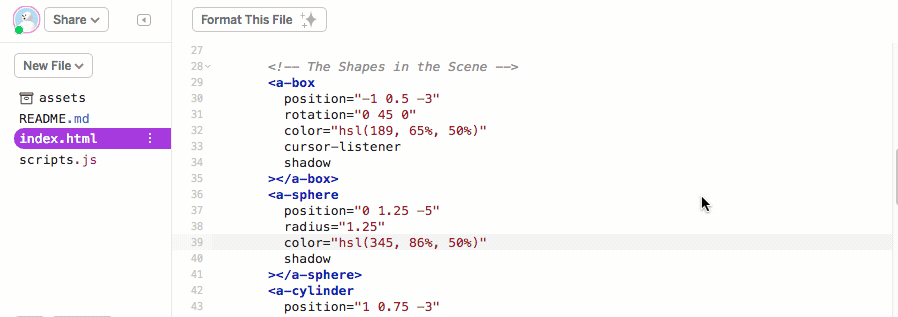

# {{ page.title }}

## Introduction

In this activity, you will learn about one way of interacting with *entities* in *A-Frame*: *Gaze-based Interactions*.

*Gaze-based Interactions* involve interacting with objects by looking at them.
They are very useful interactions to use in apps created for lower-end VR headsets (such as a phone with a *Cardboard* headset) because these headsets usually do not have a separate controller to use for interactions.

We will use the *cursor* component in *A-Frame* and some *JavaScript* code to create a scene with *Gaze-based Interactions*.

## The Interaction Project

We have created an [Interaction Starter Project](https://glitch.com/~cs4s-interaction-starter){: class="text-info" target="_blank" } to demonstrate the use of *Gaze-based Interactions* in *A-Frame*. 
The first step of this activity is to open up that starter project and remix it.

You may want to try viewing the scene on a headset before we look at the code in more detail.
What happens when you look at the different shapes in the scene?

The *cursor* (the black ring in the middle of the screen) will shrink and then go back to normal size after you look at a shape for a couple of seconds.
You may notice that the box shape changes colour each time you look at it but that the other shapes do not change colour in the same way.
We will add interactions to the other shapes, so that they change colour as well, in the next step of the activity.

The lines below create a *cursor* and attaches it to the camera, so that the cursor always follows the camera (where we are looking):

```
<a-entity camera position="0 1.6 0" look-controls>
    <a-entity
        animation__click="property: scale; startEvents: click; easing: easeInCubic; dur: 150; from: 0.1 0.1 0.1; to: 1 1 1"
        animation__fusing="property: scale; startEvents: fusing; easing: easeInCubic; dur: 1500; from: 1 1 1; to: 0.1 0.1 0.1"
        animation__mouseleave="property: scale; startEvents: mouseleave; easing: easeInCubic; dur: 500; to: 1 1 1"
        cursor="fuse: true; fuseTimeout: 1000"
        position="0 0 -1"
        geometry="primitive: ring; radiusInner: 0.03; radiusOuter: 0.05"
        material="color: black; shader: flat"
    >
    </a-entity>
</a-entity>
```

The *properties* that begin with *animation__* in the above code control the animations that happen when the *cursor* interacts with other *entities*.
For example, when we are looking at a shape, the *cursor* begins to 'fuse' and the *cursor* is animated with the instructions in the *animation__fusing* *property*.
In that animation, the *cursor* scales down from full size (1 1 1) to a smaller size (0.1 0.1 0.1) over 1500 milliseconds when it 'fuses' with another object in the scene.
That animation is what you see just before the box changes colour, after we look at with the cursor.

You may have noticed that there is another file in the project that was not in the other projects that we have worked on today: the *script.js* file.
The code in that file makes the box shape change brightness when the *cursor* is pointed at the shape.

We will not look at the use of *JavaScript* in *A-Frame* scenes in much detail in this workshop.
However, using *JavaScript* presents many opportunities to add functionality to your scenes and can be used to customise your scenes in pretty much any way that you can think of.

## Adding Interactions

At the moment, the *Gaze-based interaction* only affects the brightness of the box.
In this step, we will change the scene so that the other shapes change brightness when we look at them as well.

If you compare the other shapes' tags to the tag for the box shape, which is shown below, you may notice that the box tag has a *property* that the other tags do not.

```
<a-box
    position="-1 0.5 -3"
    rotation="0 45 0"
    color="hsl(189, 65%, 50%)"
    cursor-listener
    shadow
    >
</a-box>
```

The box tag includes the *cursor-listener* *property*, which is the name of the *component* that we have created in the *scripts.js* file. 
The other shapes' tags do not have this *property* but we will change that.

Next, add this *property* to the &lt;a-sphere&gt; and &lt;a-cylinder&gt; tags, as shown in the animation below:

<div class="row my-4">
    <div class="col-md-8 offset-md-2">
        
    </div>
</div>

Once you have added those *properties*, try viewing the scene again.
The box, cylinder and sphere will now all change colour when you look at them.
Adding this *property* to these tags results in the *cursor-listener* *component* being added to those shapes.

There are many possibilities for using *Gaze-based Interaction*, custom *components* and *JavaScript* code to create more complex VR scenes.
For example, it is possible to combine *Gaze-based Interaction* with [Checkpoint Controls](https://github.com/donmccurdy/aframe-extras/tree/master/examples/checkpoints){: class="text-info" target="_blank" } to create a scene where you can move around by looking at different locations.
The [Hall VR Museum](https://cecropia.github.io/thehallaframe/#){: class="text-info" target="_blank" } project created by Cecropia is a good example how you can use *Gaze-based Interaction* for movement.

<div class="card border-info my-4">
    <div class="card-header">Using Gaze-based Interaction in A-Frame: Challenges</div>
    <div class="card-body">
        <h5 class="card-title">Challenges:</h5>
        <ul>
            <li>Make the cursor a different colour</li>
            <li>Make the cursor a different size</li>
            <li>Change the <i>script.js</i> file to change another <i>property</i> on the shapes (like the <i>scale</i>) when you look at them</li>
            <li>Create your own component that creates an interaction for the plane shape</li>
        </ul>
    </div>
</div>

In the next session you will learn about how animations can be added to a scene in *A-Frame*.

[Back to Session Page](./){: class="btn btn-outline-info session-nav-button" }