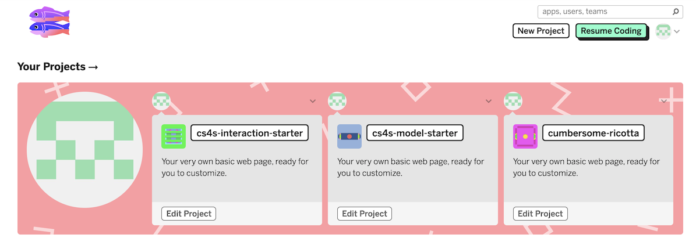
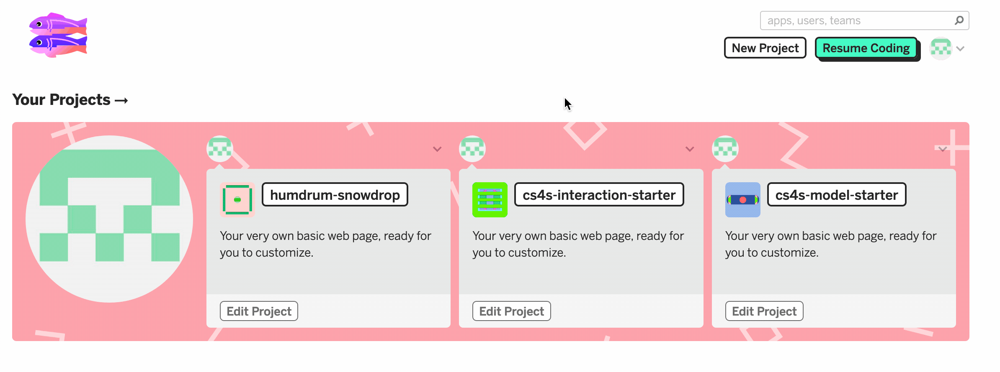
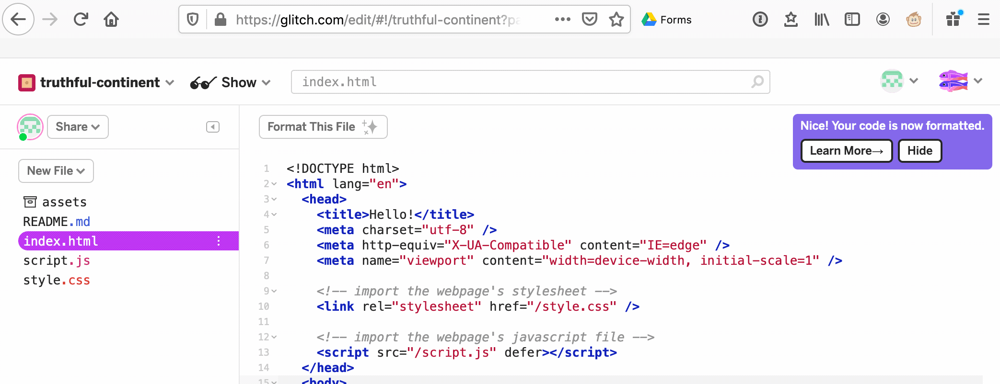
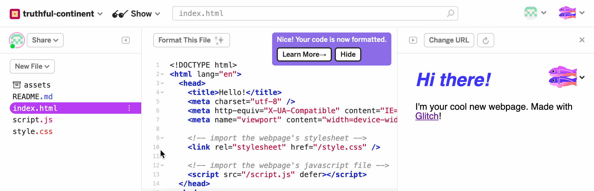

# {{ page.title }}

## Introduction

In this activity, you will learn about how to use *Glitch*.
*Glitch* is a website that allows you to create and share coding projects in a variety of languages, including *HTML*, *JavaScript* and *Python*.

On the *Glitch* website, you can see the code in projects that other people have created and you can also *remix* (take your own copy of) other people's projects, like you can in *Scratch*.

You can get to the *Glitch* website by going to *glitch.com* or by clicking [this link](https://glitch.com){: class="text-info" target="_blank"}.

## Signing into Glitch

You can create projects without registering for a *Glitch* account but we recommend that you do sign up for an account. 
Registered Glitch users can see, edit and manage all of the coding projects that they have created.

There are four different options for registering for Glitch:

- **Sign in with Facebook:** you log into your *Facebook* account and approve its use with *Glitch*
- **Sign in with Github:** the same as the *Sign in with Facebook* option but you log into your *Github* account
- **Sign in with Email:** you will be sent a temporary password to the email you signed in with, which you use for a one-time sign-in
- **Sign in with Google:** the same as the *Sign in with Facebook* option but you log into your *Google* account

We recommend that you register for *Glitch* by signing with a Google account or that you sign in with your email address for today's workshop.
If you are a teacher at a NSW Department of Education school (or if your school uses Gmail for managing email), then you may be able to use your department email and password when logging into Google for the *Sign in with Google* option.

Once you have signed up to *Glitch*, you should see a screen that looks something like this:

    

        
    

Don't worry if your screen doesn't exactly the same - you probably haven't created any projects yet!

You may want to take some time to explore some of the projects before we get started.
There are a variety of projects that have been created with *Glitch* and you can find some of these through the *Curated collections* section on the website homepage.

In the next step, we will create a new *Glitch* project.

## Creating a Project

In this step, we will create a new website project with *Glitch*.

*Glitch* has *project templates*, which can help us get started working on a project.

There are three main types of project templates in *Glitch*:

- **hello-webpage:** a template for *static* webpages
- **hello-express:** a template for *dynamic* webpages (sometimes referred to as *web apps*)
- **hello-sqlite:** a template for *dynamic* webpages that need to use databases (for example, if you were building the next *Facebook*)

We do not need the features in the *hello-express* or *hello-sqlite* project templates for our website, so we will be using the *hello-webpage* project template for this activity. 

**Create a new hello-webpage project**, as shown in the animation below:

    

        
    

The project is created and you should now see the *Project Editor*, with a preview of the *README.md* file open.
The pane on the left of the *Project Editor* shows you all of the files in the project.
The *assets* folder is where all of your images and other media files can be uploaded to and viewed.
You will learn about the *assets* folder later today when you add 3D photos and models to your VR scenes.

The files in the project, which are included in the *hello-webpage* template, are:

- **README.md:** a readme file that explains what *Glitch* is and describes the different files in the project
- **index.html:** a page written in HTML that currently has a heading and welcome message 
- **script.js:** a file where you can put in code written in *JavaScript*, which currently does not do much
- **style.css:** a file that describes the appearance (or *styles*) of the website, written in CSS

If you have some experience with web design and development, you may be familiar with these different files and languages.
However, if you not know how to use these different files and languages, that is okay!
Our focus during the workshop will be on editing HTML pages, so you do not need to worry about writing *JavaScript* or CSS during today's activities.

For more resources for web design development, we recommend [Mozilla's *Learn web development* resources](https://developer.mozilla.org/en-US/docs/Learn){: class="text-info" target="_blank"} and [HTMLDog](https://htmldog.com/){: class="text-info" target="_blank" }.

You can see what your website looks like and how it functions in the *Project Editor*, in a new tab or within a pane in the editor.
For now, we will view the website in a pane in the editor.
You can do this by clicking the *Show* icon and then selecting the *Next to the Code* option.
These steps are show in the animation below:

    

        
    

Let's take a look at the different tags and elements in the *index.html* file.

If you make changes to the *index.html* file, you may notice that these changes are automatically reflected in the pane on the right pane of the *Project Editor*.

The *Project Editor* automatically checks *syntax* and it also has a button (*Format This File*) which formats the code in a file.
The automatic syntax checking and the *Format This File* button could help us *debug* problems in our code, if we make typos or other mistakes during today's activities.

## Viewing and Sharing Projects

Whenever we create a new project in *Glitch*, the project is given a randomly-generated name (such as *'truthful-continent'* or *'humdrum-snowdrop*'). 

We can then view a live version of the website at the web address: *project-name.glitch.me*.
For example, you can see the *humdrum-snowdrop* project at the [humdrum-snowdrop.glitch.me](https://humdrum-snowdrop.glitch.me){: class="text-info" target="_blank" } address.

Our next step is to view the website that we have created.
First, try out the website you have created on another device, such as your mobile phone or another workshop participant's computer, by visiting the web address *your-project-name.glitch.me*.

Next, make some changes to the website on the lab computer that you are using and refresh the website on the other device.
You should be able to see those new changes on your other device.

*Glitch* makes it very easy for us to create a live version of our website project and share it with others, which we will be useful for making VR scenes on a lab computer and testing them on a mobile phone.

## Renaming a Project

The project names that *Glitch* generates can be long and tedious to type into a phone.
We can rename the projects to be shorter.

In *Glitch*, we can change the project name to anything we want, as long as the name is not already being used by someone else.
We suggest using initials, a meaningful acronym and a number for your projects' names.
For example, my initials are DH and I would call the project *dhvr1*.

You can rename a project by clicking the project name in the top left of the *Project Editor* and typing over the old name.
You can see these steps in the animation below, where I rename a project from *truthful-continent* to *dhvr1*:

    

        
    

It is also possible to change the description of the project, to help us remember what each of our projects are.
For example, we could change this project's description to: *'My first website project made in Glitch'*.
The project description can be changed by editing the text below the project title.

## Alternatives to Glitch

We have chosen to use *Glitch* in this workshop because it is easy to use and remix projects using it.
There are similar websites that you can use to build websites through a web browser, including [CodePen](https://codepen.io/){: class="text-info" target="_blank" } and [JSBin](https://jsbin.com/){: class="text-info" target="_blank" }.
One of *Glitch's* most useful features is the ability to upload images and other files to use in your project, which you can't do in many of the online code editors.

It is also possible to create websites (and VR scenes) without using an online tool like *Glitch* or *CodePen*.
For example, you can create websites with a text editor, like Notepad.
However, if you are creating a VR scene with A-Frame that contains images or models without an online tool, you will have to run a local web server.
The [A-Frame's Installation page](https://aframe.io/docs/0.9.0/introduction/installation.html#local-development){: class="text-info" target="_blank" } includes some suggestions for ways that you can run a local web server when using *A-Frame*.

## Next Steps

Next, you will learn about what *A-Frame* is, how to use it in *Glitch* projects and how to create and share your first VR scene.

[Back to Session Page](./){: class="btn btn-outline-info session-nav-button" }