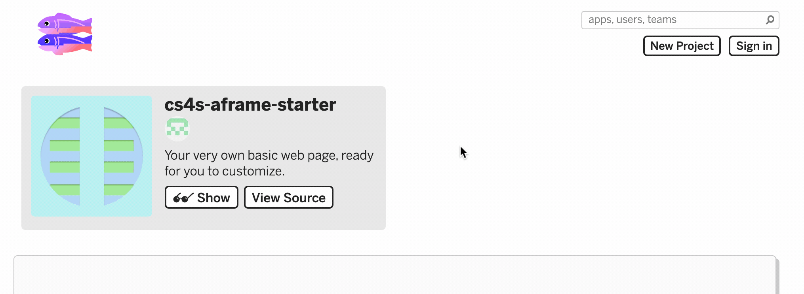
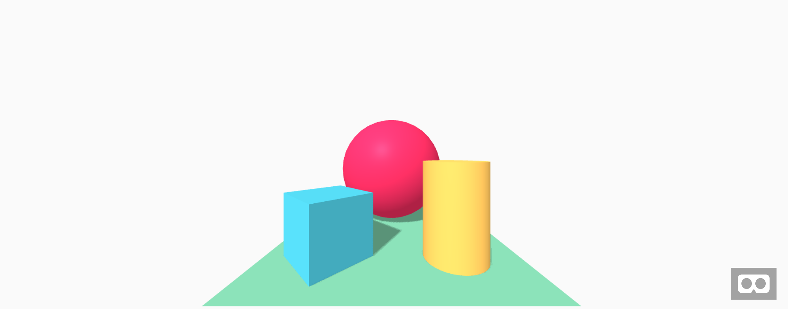

# {{ page.title }}

## Introduction

In this activity, you will learn about the *A-Frame* project and how you can use it to create VR scenes with HTML.

*A-Frame* is written in *JavaScript*, which allows it to work on pretty much any webpage.
The creators of the *A-Frame* framework created the project with the goal that anyone with some knowledge of HTML and web development could use it to create and share their own VR scenes easily.

The A-Frame homepage is available at *aframe.io* (or via [this link](https://aframe.io){: class="text-info" target="_blank"}) but we will use this framework from within the *Glitch* website during the workshop's activities.

## Remixing a Starter Project

You can remix any public project on *Glitch* by clicking the *Remix Your Own* button on the project's page.
When you remix a project, you take your own copy of that project and you can then modify that project in any way that you would like to.

We will start this activity by remixing a *Starter Project* that I created for this workshop.
A *Starter Project* is a project that has some code or *assets* (such as images or 3D models) in it already and that might need to have more code added to it.

The first step in this activity is to **remix the A-frame Starter Project** that we created for this activity, which [is available here](https://glitch.com/~cs4s-aframe-starter){: class="text-info" target="_blank" }.
You can remix the project by finding the *Remix Your Own* button, which is shown in the animation below:

<div class="row my-4">
    <div class="col-md-8 offset-md-2">
        
    </div>
</div>

When you remix a project, *Glitch* will give the remixed project a randomly generated name. 
You may want to change the project's name to make it shorter, as we did in the last activity, because we will view this page on another device later in the activity.

Before we make any changes to the project, let's take a look at the files that are in *Project Editor*.
You may notice that there are not as many files in this project as our *hello-webpage* project and there is also less HTML in the *index.html* page.

In this project, we only have 1 file: *index.html*.
We have removed the *scripts.js* and *styles.css* files from the starter project because it is possible to create a VR scene in *A-Frame* without any *JavaScript* or CSS.

Let's look at the contents of the *index.html* file. 

One of the most important lines in the *index.html* is the line shown below:

```
<script src="https://aframe.io/releases/0.9.2/aframe.min.js"></script>
```

That line brings the *A-Frame* code into our webpage - our scene would not work without this line!

What do you notice about the tags that begin with *a-* (for example: &lt;a-scene&gt;or &lt;a-box&gt;)?

## Adding More Shapes

Next, we are going to add some more shapes to the VR scene.

Compare the code in the project that you have in your project with the code in the official [A-Frame Starter Project](https://glitch.com/~aframe){: class="text-info" target="_blank" } (titled *Hello WebVR*).
What are the differences between your Starter Project and that project?
How can you change your project to match the *Hello WebVR* scene?

The differences and changes to make are explained in the collapsed panels below but try to figure it out on your own before checking the answers.

<p>
  <button class="btn btn-outline-info collapsed" type="button" data-toggle="collapse" data-target="#collapse-difference-1" aria-expanded="false" aria-controls="collapseExample">
    <span class="if-not-collapsed">
        Hide Difference #1
        <i class="fas fa-chevron-up step-icon"></i>
    </span>
    <span class="if-collapsed">
        Show Difference #1
        <i class="fas fa-chevron-down step-icon"></i>
    </span>
  </button>
</p>
<div class="collapse" id="collapse-difference-1">
  <div class="card card-body my-4">
    <p>The <i>Hello WebVR</i> scene has a red sphere in it but that shape is not in the starter project that you remixed.
    Your project will be missing the line shown below, which makes the red sphere appear:</p>
    <div class="highlighter-rouge">
        <div class="highlight">
            <pre class="highlight"><code>&lt;a-sphere position="0 1.25 -5" radius="1.25" color="#EF2D5E" shadow&gt;&lt;/a-sphere&gt;</code></pre>
        </div>
    </div>
    <p>To add the sphere to your scene, add the code in the box above into your project, after the tags that make the blue box appear.</p>
    <p>Once you add that line of code, the red sphere should now appear in your scene</p>
  </div>
</div>

<p>
  <button class="btn btn-outline-info collapsed" type="button" data-toggle="collapse" data-target="#collapse-difference-2" aria-expanded="false" aria-controls="collapseExample">
    <span class="if-not-collapsed">
        Hide Difference #2
        <i class="fas fa-chevron-up step-icon"></i>
    </span>
    <span class="if-collapsed">
        Show Difference #2
        <i class="fas fa-chevron-down step-icon"></i>
    </span>
  </button>
</p>
<div class="collapse" id="collapse-difference-2">
  <div class="card card-body my-4">
    <p>The <i>Hello WebVR</i> scene has a yellow cylinder in it but that shape is not in the starter project that you remixed.
    Your starter project is missing the line shown below, which makes the yellow cylinder appear:</p>
    <div class="highlighter-rouge">
        <div class="highlight">
            <pre class="highlight"><code>&lt;a-cylinder position="1 0.75 -3" radius="0.5" height="1.5" color="#FFC65D" shadow&gt;&lt;/a-cylinder&gt;</code></pre>
        </div>
    </div>
    <p>To add the cylinder to your scene, add the code in the box above into your project, after the tags that you added to make the red sphere appear.</p>
    <p>Once you add that line of code, the yellow cylinder should now appear in your scene</p>
  </div>
</div>

After you have found the differences in the projects and changed the code in your project, your project will look something like the image below.

<div class="row my-4">
    <div class="col-md-8 offset-md-2">
        
    </div>
</div>

Now, you can try viewing the scene in VR, using one of the provided Cardboard or Oculus headsets.
To do this, go to the web address where you can view your project - remember that this will be *your-project-name.glitch.me* - on the device that you would like to view the scene on.

When viewing an *A-Frame* scene on any WebVR-compatible device, you can go into VR mode by clicking or tapping on this button: <span class="enter-vr-container"><i class="fas fa-vr-cardboard enter-vr-icon"></i></span> (the *Enter VR* button).
Entering VR mode after clicking the <span class="enter-vr-container"><i class="fas fa-vr-cardboard enter-vr-icon"></i></span> button works differently on each of the different types of devices, as explained below:

- **On a computer:** the web browser will go full-screen and you can move around the scene with your keyboard's arrow keys and look around the scene with your mouse
- **On a mobile phone:** the phone will have to be in a horizontal orientation and, once it is in that orientation, the view will be split into a section for each of your eyes
- **On a VR headset:** the scene should become 3D and, if you are using one of the higher-end headsets, you will be able to walk around the scene

One of the great features of *A-Frame* (and *WebVR* in general) is that the scenes that you create will be compatible with a variety of devices, including desktops, mobile phones and VR headsets (like the Oculus Quest or HTC Vive).
You will learn about the different devices that are available for viewing VR in a later session in the workshop.

## Challenges

We have included challenges for you to extend your knowledge of *A-Frame* and *VR* in most of this workshop's activities.
If you are getting through the activities quickly, you may want to try to complete these challenges.

If you get stuck on these challenges, please ask one of the workshop presenters to give you some ideas.

<div class="card border-info my-4">
<div class="card-header">Creating VR with A-Frame: Challenges</div>
<div class="card-body">
    <h5 class="card-title">Challenges:</h5>
    <ul>
        <li>Make all of the shapes the same colour</li>
        <li>Make all of the shapes the same shape</li>
        <li>Move the plane so that it is positioned above the other shapes</li>
        <li>Find out what other shapes you can use in <i>A-Frame</i> and add them to your scene</li>
    </ul>
</div>
</div>

Nice work, you have completed the <i>{{ page.title }}</i> activity!
In the next session you will learn more about how VR works then learn about the tools in *A-Frame* that can help you position and change the shapes in a VR scene.

[Back to Activities Page]({{ site.baseurl | append: '/vr/activities'}}){: class="btn btn-outline-info session-nav-button" }